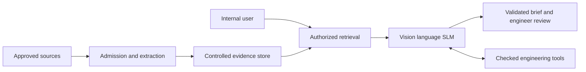

# Broadbridge Oil and Gas multimodal SLM project delivery plan
CTO program recommendation | 23 September 2026

This plan supersedes earlier text-only and paid-pilot assumptions for the proposed internal multimodal pilot. Financial assumptions and acceptance targets remain proposals.

## 1 Executive decision

Develop Broadbridge Process SLM as an internal engineering assistant for Broadbridge Oil & Gas, a subsidiary of Broadbridge4096. Adapt a small vision-language foundation model, combine it with controlled retrieval and validated calculations, and require engineering review of diagnostic briefs. The first practice is refining, with distillation and vacuum systems supported by heat transfer, pumps and instrumentation.

Fund an eight-week discovery and baseline tranche within a conditional 24-week program. Prove the value of image inputs before committing to visual fine-tuning. Preserve a deployable text and retrieval baseline if vision or tuning does not improve the workflow.

| Planning commitment | Recommended scope |
|---|---|
| Primary user | Broadbridge process engineers and contracted reviewers working under approved internal access. |
| First release | English text plus selected diagrams, scanned calculations and plots. Read-only evidence analysis. |
| Success | Better expert-accepted briefs with less review effort; traceable sources and reproducible calculations. |
| Team | Seven launch employees; 4.25 FTE allocated to this program, plus contracted expertise and parent services. |
| Dataset target | 2,000 training examples, including 500 image-and-text examples if the vision gate passes. |
| Schedule and cost | 24 weeks from funded mobilization; illustrative total economic cost $849,600–$1,562,400. |

### How this plan changes the earlier program

This plan replaces the earlier text-only launch scope and paid-pilot milestone with a limited multimodal internal pilot. It retains the seven-role organization, 300-family split and 2,000-example target. Its cost model replaces the earlier estimate for this scope; the two budgets are not additive. Data will not be productized. External access, model distribution and additional industry practices are separate decisions.

The methods align with recognized AI governance and secure-development frameworks; there is no single universal standard for an oil-and-gas SLM. This plan makes no certification or operational-safety claim. All performance thresholds, staffing allocations and financial figures are proposed planning assumptions. [N1](https://www.nist.gov/itl/ai-risk-management-framework) [N2](https://www.nist.gov/publications/artificial-intelligence-risk-management-framework-generative-artificial-intelligence) [N3](https://csrc.nist.gov/pubs/sp/800/218/a/final)

The immediate parent decision is whether to fund mobilization and the first tranche. This document itself authorizes no expenditure, content use, deployment or expert appointment.

## 2 Objectives and release boundaries

The system helps an engineer turn incomplete process evidence into a reviewable diagnostic brief. It should distinguish observations from hypotheses, identify missing information, use checked calculations, explain uncertainty and link its conclusions to the evidence.

| Use case | Required first-release behavior |
|---|---|
| Evidence review | Read approved text, a selected diagram or plot and structured operating observations; preserve source and time context. |
| Diagnostic brief | Present plausible causes, supporting and contradictory evidence, missing measurements and limits of the conclusion. |
| Expert knowledge search | Retrieve licensed passages and prior cleared cases, with exact page, figure or time references. |
| Calculation support | Request typed inputs for approved engineering tools and report assumptions, units and returned results. |
| Internal training | Explain accepted cases and misconceptions using source-linked examples; keep test answers inaccessible. |

### Visual scope

Prioritize expert sketches, equipment sections, selected process-flow diagrams, legible calculation sheets and plots. Complex piping and instrumentation diagrams (P&IDs) enter only as bounded, expert-labeled regions with an overview. Whole-plant connectivity inference, automated drawing approval, quantitative inspection from photographs and unrestricted video interpretation are outside release one.

Transcribe interviews with a separate approved speech service. Preserve the slides or frames needed to understand the explanation. Analyze historian exports through numerical tools; original time series take precedence over estimated values from screenshots.

### System and organizational boundaries

No DCS, PLC or safety-instrumented-system write access is provided. Use approved offline exports or an independently accepted read-only data path. Every pilot diagnostic brief requires a designated engineer to accept or reject it; generated text is not an authorization to change plant settings.

Private cloud is the planning default, with deployment region, provider, approved processors and data residency fixed by week 2. No confidential material goes to an external model by default. An on-premises requirement triggers a cost and schedule revision. Gas processing, LNG, upstream, drilling and subsurface capabilities require separately funded specialists and validation.

The application must show a useful partial result when evidence is missing, label unreadable image regions and allow an engineer to correct extracted facts before analysis. It must not manufacture precise values or confidence percentages.

## 3 System architecture and interfaces

The ingestion path and runtime path share a permission-controlled evidence store. Training uses an approved snapshot in a separate environment. A request cannot expand its own access through a prompt, an image or a model-generated tool argument.

| Component | Versioned input and output |
|---|---|
| Admission and extraction | Input file and grant ID → quarantined original, hash, extracted text/table/regions and quality flags. |
| Evidence service | Authorized identity and query → permitted passages, image regions, source revisions and citation identifiers. |
| Model and tool gateway | Evidence packet → structured hypotheses, evidence references, missing facts and allowlisted calculation requests. |
| Checked tools | Typed quantities, units and regime → results, tolerances, method version and validation status. |
| Brief and review service | Validated response → source-linked brief, reviewer disposition, corrections and complete release identifier. |

A failed access check stops retrieval. An unreadable value remains unknown. A tool error or out-of-range input produces an explicit limitation. Schema validation rejects malformed output, but technical correctness still needs evidence and review.

For the first implementation, use object storage for originals, PostgreSQL for metadata and permissions, hybrid lexical/vector retrieval, and containerized model serving. Select the exact encoder, reranker, OCR and serving versions at the compatibility gate; every choice must pass the same source-access and reproducibility tests.

## 4 Foundation models and architecture decision

Evaluate commercially usable small vision-language models against a text-only control. The foundation model remains third-party licensed; Broadbridge's domain adapter, code and curated examples are separately owned or licensed under their contracts.

| Candidate | Verified basis | Role in experiment |
|---|---|---|
| Qwen3.5 4B | 4B language component with vision encoder; Apache 2.0 card. | Primary multimodal candidate; test language-only and image inputs. |
| Ministral 3 8B Instruct 2512 | 8.4B language model plus 0.4B vision encoder; Apache 2.0; instruct release is FP8. | Alternative multimodal candidate; verify training precision and export support. |
| Qwen3 8B | Text-generation model with Apache 2.0 card. | Text plus OCR, retrieval and tools control. |

These publisher facts support candidacy, not refinery competence. Pin model, processor, tokenizer, license and source revisions. Refresh the shortlist once at week 2, then hold it stable through selection unless a blocking defect requires a documented change. [M1](https://huggingface.co/Qwen/Qwen3.5-4B) [M2](https://huggingface.co/mistralai/Ministral-3-8B-Instruct-2512) [M3](https://huggingface.co/Qwen/Qwen3-8B)

### Compare three system choices

Option A is a text SLM with verified extraction, retrieval and tools: simplest to curate and an essential baseline. Option B is a vision-language SLM with the same retrieval and tools: recommended when the original image adds measurable value. Option C separates a visual extraction model from a text SLM: useful if extraction is the main gain, but introduces another error boundary and serving component.

Use both cross-model comparisons and within-model ablations. Comparing two unrelated models alone cannot isolate the benefit of vision. For each multimodal candidate compare identical questions and OCR text, with and without the image; then compare tuned and untuned versions with the same evidence.

### Compatibility acceptance

Before a substantive run, demonstrate a small text-and-image adapter can train, save, reload and serve. Check image preprocessing, token counts, loss masking, tool parsing and output stability. A memory-fit or kernel failure is a technical gate, not grounds to assume another model's recipe will work.

Use existing runtimes and annotation tools. Defer custom foundation pretraining, a bespoke vision encoder, reinforcement learning infrastructure and a new vector database. Keep an adapter-free release available if fine-tuning adds no measurable value.

## 5 Data sourcing and expert participation

Build a corpus around supported engineering decisions. Commission original cases and explanations, license selected publications, and add validated tool examples. Use customer material only within its explicit grant. Public availability and internal business use do not by themselves clear training rights.

| Source group | Contribution and control |
|---|---|
| Norm and other experts | Interviews, sketches, case threads, failed hypotheses, calculation checks and applicability limits; original contribution agreement. |
| Published references | Selected articles, chapters and conference papers; exact edition, publisher/coauthor rights and permitted AI uses. |
| Work papers and email | Complete chronology and attachments through resolution; client and correspondent interests reviewed. |
| Public technical sources | Cleared sourcebooks and investigations; inspect contributed figures and license exceptions. |
| Customer records | Permitted incident evidence and outcomes; no shared training merely because access is available. |
| Synthetic scenarios | Expert-defined conditions and validated simulations; mark generated content and retain source lineage. |

Norman Lieberman remains an illustrative founding expert candidate. His firm's published scope supports a distillation and vacuum agenda; it does not establish availability or rights. Contract a second contributor and a separate reviewer so the program can proceed without dependence on one individual. [E1](https://www.lieberman-eng.com/)

### Rights and ownership

The rights ledger records the source owner, agreement, permitted entities and processors, storage, OCR/transcription, retrieval, training, evaluation, internal model operation, expiry and termination treatment. Broadbridge4096 affiliation does not automatically authorize access by every affiliate. Internal productivity can be commercial advantage under noncommercial terms; obtain the appropriate grant or a documented legal basis. [R1](https://creativecommons.org/faq/#does-my-use-violate-the-noncommercial-clause-of-the-licenses) [R2](https://onlinelibrary.wiley.com/library-info/resources/text-and-datamining)

Keep foundation-model rights, expert background works, newly commissioned datasets/adapters and customer permissions separate. Prefer retrieval for revocable customer facts. A deletion request must remove affected retrieval material promptly; trained weights may require retirement or retraining rather than a claim of reliable unlearning.

### Capture cadence

Begin with an inventory of 20–30 candidate incidents from each lead contribution stream, then capture the strongest evidence-rich cases. Weekly curation pairs the Knowledge Engineer with the Process Applications Engineer; the Technical Director assigns independent review and records disagreement. Track accepted families per hour, not interview hours alone.

## 6 Multimodal annotation and data contracts

The primary training record joins an observation with a task and a reviewed answer. It must preserve the distinction between visible evidence, information supplied elsewhere and the expert's inference. A picture alone is not a confirmed diagnosis.

| Record group | Required fields |
|---|---|
| Identity and rights | asset_id, case_family_id, version, hash, grant_id, permitted_use, access_group and expiry. |
| Evidence | original URI, page/frame/time, image dimensions, crop transform, region coordinates, text/table extraction and quality flags. |
| Engineering context | equipment/stream IDs, units, pressure basis, timestamp, regime, measurement quality and missing facts. |
| Task and answer | prompt, evidence available then, expected response, supporting region/source IDs, alternatives and applicability limits. |
| Calculation and review | tool inputs/version/results/tolerance, author, independent reviewer, corrections and acceptance status. |
| Split and lineage | train/dev/test, source family, parent transformations, synthetic flag and release manifest. |

### Visual labeling rules

Label equipment tags, symbols, units, flow direction and connections separately. Link every engineering claim to a region or a supplied measurement. Mark ambiguous line crossings, occlusion and illegible handwriting as unknown; do not infer a connection solely from proximity. Preserve an overview alongside crops so extraction retains context.

Verify OCR against originals for numerical values, decimal points, signs, subscripts and pressure units. Keep original chart data where available, with the image as a view. Annotate axes, scales and legends; do not treat a visually estimated point as an exact measurement.

Use the selected model's native image processor. Cap images and token budgets after profiling; reject unsupported dimensions or low-quality assets with a clear request for better evidence. No geometric transform, mirrored drawing or altered number enters training without confirming that its engineering meaning is preserved.

### Reusable examples and quality control

A reviewed image may support a tag-reading task, an evidence-selection task and a diagnostic task, all in the same family and split. At least one reviewer checks the original visual evidence, not only the generated caption. Include wrong annotations as explicit correction tasks only after confirming the correct answer.

Documents and images are untrusted evidence, not instructions. Quarantine embedded scripts and macros, scan files, and strip executable content before extraction. Preserve the original in controlled storage for audit.

## 7 Dataset size and contamination controls

Use 300 distinct incident/scenario families as a planning target: 180 training, 60 development and 60 locked test. All crops, retellings, email attachments, chapter derivatives and synthetic variants of a family stay together. A document may contain multiple incidents; the split follows incident identity and shared evidence, not file names.

| Training task | Text examples | Image and text | Total |
|---|---|---|---|
| Diagnostic briefs | 625 | 275 | 900 |
| Missing-data questions | 300 | 100 | 400 |
| Calculations and tool use | 225 | 75 | 300 |
| Grounding and citations | 170 | 30 | 200 |
| Uncertainty and escalation | 180 | 20 | 200 |
| Total | 1500 | 500 | 2000 |

The 500 visual examples are a proposed 25% allocation, not a proven optimal ratio. Target at least 90 visual-capable training families within the 180; multiple crops do not create new families. If the vision gate fails, reallocate to approved text examples and revise the release claim. Topic totals remain 700 distillation, 500 vacuum, 400 heat/steam, 200 hydraulics and 200 instrumentation.

### Evaluation inventory

Reserve 30 visual-capable families within each 60-family development and test partition. The locked test contains 120 tasks: two per family, comprising 60 visual tasks from 30 families and 60 text tasks from the other 30. Paired modality experiments reuse task IDs and are not counted as new independent cases.

Add 180 separately authored challenge prompts: 60 visual ambiguity/perception tasks, 60 grounding/tool/scope tasks and 60 security/access/injection tasks. Keep their scenarios and all answer keys outside training. The 300 acceptance prompts are correlated and are not 300 independent plant incidents.

### Lineage and independence

Freeze split manifests before example generation. Search near-duplicate text, image hashes, plant identifiers and shared outcomes. Keep held-out resolutions out of retrieval, prompt examples, teacher-model prompts, tool caches and support documents. Admit only question-time evidence for the evaluation task.

Public material may already have appeared in a foundation model. Report those cases as regression coverage; use fresh expert-authored or confidential cleared cases for stronger generalization evidence. A source or scenario reassignment requires benchmark review and a new version.

Release targets are conditional on rights and diversity. If too few independent cases are available, narrow scope or extend collection rather than creating many paraphrases to satisfy a count.

## 8 Training and experiment protocol

Use supervised fine-tuning with parameter-efficient adapters. First improve the diagnostic text workflow; then test mixed text-and-image supervision. Existing frameworks support vision-language SFT and quantized adapters, but model-specific compatibility must be demonstrated. [T1](https://huggingface.co/docs/trl/en/sft_trainer) [T2](https://huggingface.co/docs/peft/en/developer_guides/quantization)

| Experiment | Purpose |
|---|---|
| A Text control | Qwen3 8B plus OCR, retrieval and checked tools. |
| B Native multimodal | Untuned vision-language candidate with identical sources and tools; compare image versus OCR-only inputs within the model. |
| C Text adaptation | Domain adapter on text examples; measure diagnostic improvement and vision retention. |
| D Mixed adaptation | Same candidate with the proposed text/image mix; compare to B and C on unchanged development tasks. |
| E Extraction alternative | Separate visual extraction and text control, if development results show extraction is the dominant gain. |

### Bounded initial recipe

Start with LoRA rank 16 or 32 on supported language projections, one epoch and a small learning-rate search such as 5e-5 and 1e-4. Use BF16 adapters and QLoRA only when the architecture, kernels and export path pass the smoke test. Profile batch and accumulation to an effective batch near 16–32. These are experiment hypotheses, not vendor-prescribed settings.

Initially freeze the vision encoder and train supported language adapters. Test projector adaptation only for a measured alignment gap. Full vision-encoder tuning needs additional data and a separate gate. Confirm that language-only adaptation has not degraded image interpretation.

Begin with an 8,192-token total training budget including image tokens, one overview and up to two crops per example where the processor fits that budget. Reject or re-author oversized samples; never silently truncate away image tokens or answer evidence. Disable multimodal packing until boundary behavior is verified. Mask prompts and image/context tokens from the target loss as appropriate to the framework.

### Reproducibility and selection

Version data, processor, prompts, tool schemas, code, environment, seed and model revisions together. Budget at most eight development configurations per finalist, stop on validation degradation, and repeat the selected configuration across three seeds. Record failed runs and GPU hours. Test the actual quantized serving artifact after export.

Use development data for model selection; lock the candidate before final test access. Optional preference training requires an observed residual behavior problem and a separately approved experiment. Continued pretraining and training from scratch are deferred.

## 9 Acceptance tests and decision thresholds

The Technical Director owns technical acceptance. Two independent reviewers score material diagnostic cases, with adjudication of disagreement. They must not certify their own authored cases. Establish rubrics and numeric tolerances before opening the locked suite. Proposed thresholds below are Broadbridge gates, not industry standards.

| Measure | Proposed internal-pilot gate |
|---|---|
| Diagnostic usefulness | At least 85% of applicable held-out diagnostic tasks accepted without material correction; report text and visual slices. |
| Evidence grounding | At least 95% of material factual claims supported by supplied evidence or verified tools; zero fabricated source IDs. |
| Visual fidelity | At least 98% exact match on predefined legible critical tags/units/values; at least 95% edge precision and recall on bounded connection tasks. |
| Calculations and uncertainty | At least 98% correct on predefined tool/numeric tasks within fixed tolerances; at least 95% correct escalation on insufficient-evidence tasks. |
| Hard failure veto | Zero observed critical errors, unauthorized disclosures or unauthorized tool actions in the gate suite; no unresolved high-severity security finding. |
| Runtime and workflow | p95 completed brief within 60 seconds at five concurrent users on the declared workload; target 25% lower median time to an accepted brief. |

A critical error is one that invents or misreads evidence in a way that materially changes the diagnosis, fabricates a safety limit, discloses restricted information, or enables an unauthorized action. Averages cannot override that veto. Finite testing does not establish that such failures are impossible.

### Investment tests

At week 8, proceed with visual fine-tuning only if image access yields at least a 5 percentage-point gain in accepted visual tasks or at least 15% less expert correction time at matched quality, without worsening critical errors. At week 16, retain a tuned adapter only if it adds at least 5 points of acceptance or 15% review-time reduction over its untuned counterpart with the same inputs and tools.

Report task denominators, exclusion reasons, family-clustered paired intervals and each visual subtype. Require evidence of benefit beyond the point estimate; inconclusive results trigger more evaluation or the simpler baseline. Changes after locked-test failure require a fresh holdout for the affected claims.

The performance workload is a proposal: up to 8,000 text tokens, two image crops within the measured image-token cap, up to three tool calls and an 800-token brief. Publish actual hardware, precision, context, image resolution and concurrency with results. Benchmark failures in retrieval separately from perception and reasoning.

## 10 Security and engineering assurance

Apply the parent security program to the complete data-to-model lifecycle. NIST's AI secure-development profile and OWASP's LLM risks inform the threat model; they do not replace application-specific testing. Keep the assistant outside plant control authority. [N3](https://csrc.nist.gov/pubs/sp/800/218/a/final) [N4](https://genai.owasp.org/llm-top-10/) [N6](https://csrc.nist.gov/pubs/sp/800/82/r3/final)

| Control boundary | Required implementation evidence |
|---|---|
| Identity and isolation | SSO/MFA, least-privilege identities, per-project access groups, separate dev/test/pilot roles and negative access tests. |
| Retrieval and caches | Apply permissions before search and reranking; propagate to images, cached prompts, snippets, logs and exports. |
| Model and document supply chain | Approved origins, pinned hashes, dependency/container scans, software bill of materials; disable unreviewed remote code. |
| Untrusted inputs | Image/text prompt-injection tests, malicious PDF/macro quarantine, poisoning checks and schema-validated tool arguments. |
| Tools and network | Named tools only; resource limits and egress allowlists; no arbitrary shell, browsing or control-system writes. |
| Data lifecycle | Encryption, keys held under parent policy, grant expiry, retention schedules, backup controls and demonstrated deletion/revocation. |
| Serving safeguards | Request/image/token caps, rate limits, logging minimization, content-provider telemetry controls and tested rollback. |

### Engineering authority

The Technical Director can suspend unsupported technical behavior. The designated parent security lead accepts security controls. The Head of Product & AI is the single software-release owner and can release only after both acceptance records exist. An independent process-safety reviewer checks scope and escalation behavior; this is not a safety-system certification.

### Required adversarial scenarios

Test instructions hidden in diagrams, forged source identifiers, an expired article still in cache, an image from another project, malicious tool values, corrupted units, a drawing revision mismatch, and requests to infer unreadable measurements. Confirm failures are visible and deny access by default.

For a potential data disclosure or critical engineering defect, disable the affected capability, preserve restricted evidence and notify the Technical Director and security lead. Parent incident procedures determine reporting obligations. Restart requires remediation, targeted revalidation and the same release approvals.

## 11 Schedule and stage decisions

The 24-week schedule starts when funding, protected staff time and initial access are available. It is conditional on source rights and reviewer capacity. Work packages overlap; dependencies and acceptance are recorded in the accompanying execution register.

| Stage | Weeks | Evidence required to proceed |
|---|---|---|
| G0 Mobilization | 1–2 | Signed charter and internal-use scope; deployment/security owner; rights route; staffing; preliminary risk register and rubrics. |
| G1 Working baseline | 3–6 | Rights-aware ingestion and retrieval; checked tools; model train/reload/serve smoke test; first 400 accepted examples and 20 dev families. |
| G2 Vision decision | 7–8 | Paired visual/OCR benchmark, cost profile and contamination audit; fund the next tranche only if the selected path is justified. |
| G3 Candidate freeze | 9–16 | 2,000 accepted training examples and 300-family manifests; text and mixed experiments; development report and reproducible candidate. |
| G4 Shadow acceptance | 17–20 | Locked technical evaluation, adversarial testing, access review, restore/rollback rehearsal and internal user instructions. |
| G5 Internal pilot | 21–24 | Four weeks of supervised use; target 10 users and 100 reviewed briefs; quality, effort and operations report; continuation decision. |

The first 400 examples are a proposed subset of the final target: 300 text and 100 image/text records. They do not authorize training before permissions and independent content review. At G2, insufficient evidence or unavailable rights supports narrowing the pilot, not silently relaxing acceptance.

### Dependency and change control

The critical path is rights and case inventory → accepted annotations and split freeze → compatibility and baseline → selected adaptation → independent validation → security acceptance → supervised pilot. Cloud procurement and approved identities begin in parallel with sourcing.

Weekly workstream reviews examine accepted artifacts, spend and blockers. The Managing Director chairs a fortnightly delivery review; the Subsidiary Board reviews each funding gate. Any proposed new practice, customer access, deployment region, foundation revision or data use includes its evaluation and budget impact.

An unsuccessful vision gate returns the program to text plus extraction. An unsuccessful tuning gate retains an untuned model with retrieval/tools. A failed release gate postpones pilot use until the defect is resolved and the affected evidence is refreshed.

## 12 Work packages and engineering handoff

The execution register provides one accountable owner, dependencies, output and acceptance check for each work package. These are commissioning units for engineering sprints; detailed code tasks follow the selected architecture at G1.

| Package | Owner | Reviewable deliverable |
|---|---|---|
| WP01 Scope and value | Head of Product & AI | Charter, user journeys, exclusions and measured current workflow. |
| WP02 Sources and rights | Managing Director | Source schedule, internal-use grants and approved access boundaries. |
| WP03 Cases and annotations | Knowledge Engineer | Expert-reviewed evidence records, visual labels and case-family lineage. |
| WP04 Environment and security | Parent security lead | Approved environment, identities, threat model and security test plan. |
| WP05 Ingestion and retrieval | Applied AI Engineer | Versioned evidence store, quality flags, citations and enforced permissions. |
| WP06 Engineering tools | Process Applications Engineer | Typed tool contracts, numeric tolerances and independent reference tests. |
| WP07 Baselines and serving | Applied AI Engineer | Reproducible text and visual baselines with memory/latency measurements. |
| WP08 Adaptation experiments | Head of Product & AI | Selected adapter or documented baseline decision with ablations. |
| WP09 Independent evaluation | Technical Director | Locked test, blinded ratings, slice results and acceptance recommendation. |
| WP10 Review workflow | Head of Product & AI | Evidence viewer, editable extracted facts, diagnostic brief and review audit. |
| WP11 Release and operations | Head of Product & AI | Signed release manifest, monitoring, restore and rollback runbooks. |
| WP12 Supervised pilot | Technical Director | Reviewed briefs and quality outcomes; product lead measures user effort. |

Interfaces are versioned as EvidenceAsset, TrainingExample, ToolRequest/ToolResult and DiagnosticBrief. Code reviews must test unauthorized-source rejection, wrong-unit rejection, missing-region handling, adapter reload equivalence and isolation of benchmark answers.

Sprint completion requires a working demonstration, reviewed documentation and the package acceptance evidence. An experiment result may legitimately conclude that a component should not be built.

## 13 Team capacity and decision rights

Use the seven-person launch organization. The Head of Product & AI holds the technical program leadership function described here as the CTO role; no eighth employee position is added. Program allocations are protected capacity across 24 weeks, not new headcount.

| Employee role | Program FTE | Hours |
|---|---|---|
| Managing Director | 0.25 | 240 |
| Commercial Director | 0.25 | 240 |
| Technical Director | 0.5 | 480 |
| Process Applications Engineer | 0.75 | 720 |
| Head of Product & AI | 0.5 | 480 |
| Applied AI Engineer | 1 | 960 |
| Knowledge Engineer | 1 | 960 |
| Total | 4.25 | 4080 |

Reserve 800–1,200 contracted expert/reviewer hours and 200–400 implementation-specialist hours. The latter supports MLOps, visual annotation tooling and evaluation automation to reduce dependence on the single Applied AI Engineer. Parent finance, legal, HR and security remain shared services. Additional hiring requires the existing parent approval route.

### Single accountable owners

Broadbridge4096 approves capital, annual budget, senior appointments and material IP transactions. The Managing Director owns delegated contracts and program execution. The Technical Director owns technical acceptance, independent review and internal pilot delivery. The Head of Product & AI owns architecture, backlog, dataset/software release and ongoing service operation.

The parent security lead owns security acceptance; the Knowledge Engineer owns source records and annotations; the Process Applications Engineer owns engineering-tool correctness. Review conditions do not create multiple accountable owners for a decision. The Commercial Director helps validate future demand but cannot expand internal pilot access.

### Expert independence

Experts advise through the Technical Director and can escalate to the Subsidiary Board. They have no automatic management authority. An author does not approve their own acceptance material. A contracted reviewer controls the locked answers; disagreement is retained and adjudicated by a separately qualified reviewer.

If the 4.25 FTE cannot be protected, revise the schedule before committing a date. Customer delivery and academy obligations draw on the same people.

## 14 Budget and economic checkpoints

The estimate is a planning range in USD for 24 weeks, not supplier quotes, approved funding or a valuation. It includes employee opportunity cost and an explicit multimodal allowance. The low and high columns are consistent scenarios; do not mix them into a precision claim.

| Category | Basis | Low | High |
|---|---|---|---|
| Employee allocation | 4,080 h × $100–$150 | $408,000 | $612,000 |
| Experts and reviewers | 800–1,200 h × $250–$350 | $200,000 | $420,000 |
| Implementation specialist | 200–400 h × $150–$200 | $30,000 | $80,000 |
| Cloud and compute | Training, evaluation, pilot and storage allowance | $20,000 | $50,000 |
| Legal and security | Incremental work or parent allocation counted once | $30,000 | $60,000 |
| Content rights | Negotiated-license allowance | $20,000 | $80,000 |
| Subtotal |  | $708,000 | $1,302,000 |
| Contingency | 20% of subtotal | $141,600 | $260,400 |
| Total economic cost |  | $849,600 | $1,562,400 |

If program payroll is already funded, costs beyond that allocation are $360,000–$828,000 including 20% contingency, before adjusting already-covered parent services. The balance of the seven employees' payroll is outside this program allocation. Do not add the full economic cost to already-funded payroll.

### First eight weeks

The first tranche is $262,800–$463,200 including allocated employee cost, or $99,600–$218,400 beyond funded payroll. It is included in the 24-week total. Basis: 1,360 employee hours; 200–300 expert hours; 60–120 specialist hours; $4,000–$8,000 cloud; $10,000–$20,000 legal/security; $10,000–$25,000 rights; the same hourly ranges and 20% contingency.

### Procurement and value

Rent GPU capacity initially; size a 48–80 GB training allowance and a 24–48 GB serving allowance through profiling rather than assuming fit. Image tokens, context and concurrency govern memory. Obtain provider/region quotes by G1 and cap experiment spend per run.

Track cost per accepted brief as infrastructure plus review labor divided by accepted briefs. Compare with measured current-workflow effort, including correction time. Freeze a steady-state monthly cost forecast before G4; no ROI claim is made until the pilot produces observed quality and effort data.

## 15 Release operations and incident response

Release the complete system as one reproducible package. A model checkpoint alone is not a deployable engineering assistant.

| Release evidence | Required record |
|---|---|
| Model and software | Foundation/adapter hashes, processor, serving precision, code/container versions, dependency inventory and tool schemas. |
| Data and rights | Approved snapshot and grants, family manifests, source revisions, deletion/expiry rules and benchmark isolation report. |
| Quality and security | Evaluation denominators and slices, reviewer decisions, adversarial results and technical/security acceptance. |
| User operation | Internal audience, scope, review procedure, source inspection, corrections and escalation guidance. |
| Recovery | Previous approved release, rollback rehearsal, backup restore test and incident contacts. |

### Monitoring and change

Monitor rejected briefs, unsupported claims, unreadable regions, retrieval misses, tool failures, revoked-source access, latency, GPU use and cost. During the pilot, every brief is reviewed; weekly samples receive a second review. Never feed user corrections directly into online training.

Quarantine feedback, confirm permissions, group it by case family, review it and release through the normal dataset process. A new model, adapter, quantization, processor, prompt, retrieval index or tool version triggers impact-based regression. Material scope or visual changes require full technical reacceptance.

### Service and incident targets

Proposed pilot service window is business hours with a 99% availability objective; quality vetoes take priority over uptime. Recovery objectives are four business hours for service restoration and 24 hours of maximum data loss for backed-up review records. Demonstrate these objectives in a restore exercise before G4.

Immediately disable the affected capability upon a credible critical engineering defect or unauthorized disclosure. Technical incidents go to the Technical Director; security incidents to the parent security lead. The product lead coordinates containment and rollback; the Managing Director handles contractual communications under parent policy.

Restart requires documented root cause, corrected artifacts, regression evidence and the original acceptance conditions. If the source grant changes, trace affected retrieval data and adapters; retire or rebuild artifacts when required. Plan decommissioning with approved retention and deletion evidence.

## 16 Risks assumptions and next actions

| Risk | Owner | Response and trigger |
|---|---|---|
| Rights or expert delay | Managing Director | Source inventory by week 2; alternate experts and cleared public/original material; reduce scope if grants lag. |
| Weak visual evidence | Technical Director | Reject unreadable annotations; paired vision test at week 8; preserve text/extraction route. |
| Too few independent cases | Knowledge Engineer | Weekly family count and duplicate audit; extend collection rather than inflate variants. |
| No tuning benefit | Head of Product & AI | Learning curves and untuned control; retain baseline if benefit is unsupported. |
| Engineering hallucination | Technical Director | Critical-error veto, tool checks, independent ratings and mandatory pilot review. |
| Data leakage or poisoning | Parent security lead | Access tests across images/caches/logs; quarantine sources and immediate containment. |
| Capacity bottleneck | Managing Director | Protect program FTE; contract bounded implementation support; reforecast schedule. |
| Model or runtime incompatibility | Applied AI Engineer | Train/reload/serve smoke test; pinned fallback; re-evaluate on changes. |

### Assumptions to close during mobilization

By week 2, the Managing Director confirms funding, expert availability and permitted internal users. The product lead confirms provider/region, hardware access and supported formats. The Technical Director confirms launch tasks and independent reviewers. Parent legal/security confirm rights terms, retention and processor boundaries. These are planned mobilization decisions, not missing content in this plan.

### First ten business days

Days 1–2: approve the charter and assign named owners. Days 3–4: inventory source rights and the first visual cases; measure the current brief-writing workflow. Days 5–6: provision the controlled environment and draft task rubrics. Days 7–8: complete one expert case and one annotated diagram end to end. Days 9–10: review the sample, confirm the release boundaries and authorize the bounded baseline work.

The end-of-program decision is continuation, scope reduction or retirement based on observed quality, workflow value, cost and residual risk. Future customer-facing software or licensing offers require separate permission and product decisions; internal training alone does not establish those rights.

Original source documents, previous plans and the Energy Trading folder link are preserved. The trading-company materials remain organizational examples; this program is not a trading-desk support project.

## 17 Standards alignment and reference record

Use the following frameworks as an evidence structure. The controls in this plan are Broadbridge's proposed implementation, not quoted requirements or a claim that compliance has been audited.

| Reference | Program evidence |
|---|---|
| NIST AI RMF 1.0 and AI 600 1 | Charter and owners; context/risk register; evaluation; release, monitoring and incident decisions. [N1](https://www.nist.gov/itl/ai-risk-management-framework) [N2](https://www.nist.gov/publications/artificial-intelligence-risk-management-framework-generative-artificial-intelligence) |
| NIST SP 800 218A | Secure build, source/model provenance, dependency review, protected artifacts and reproducible releases. [N3](https://csrc.nist.gov/pubs/sp/800/218/a/final) |
| OWASP LLM Top 10 2025 | Threat scenarios for injection, data disclosure, supply chain, poisoning, tool authority and resource consumption. [N4](https://genai.owasp.org/llm-top-10/) |
| ISO IEC 42001 2023 | Management-system direction: objectives, accountability, records and improvement. Formal clause mapping requires the licensed standard. [N5](https://www.iso.org/standard/42001) |
| NIST SP 800 82 Revision 3 | OT separation and controlled read-only evidence paths; the assistant is outside control authority. [N6](https://csrc.nist.gov/pubs/sp/800/82/r3/final) |

NIST states that AI RMF 1.0 is under revision and identifies a 2026 critical-infrastructure profile concept note. Use the published baseline here; do not present the concept note as a completed requirement. The product lead rechecks standards at each funding gate. [N1](https://www.nist.gov/itl/ai-risk-management-framework)

### Technical and licensing references

Foundation model cards [M1](https://huggingface.co/Qwen/Qwen3.5-4B) [M2](https://huggingface.co/mistralai/Ministral-3-8B-Instruct-2512) [M3](https://huggingface.co/Qwen/Qwen3-8B); training and adapter documentation [T1](https://huggingface.co/docs/trl/en/sft_trainer) [T2](https://huggingface.co/docs/peft/en/developer_guides/quantization); noncommercial interpretation and publisher terms [R1](https://creativecommons.org/faq/#does-my-use-violate-the-noncommercial-clause-of-the-licenses) [R2](https://onlinelibrary.wiley.com/library-info/resources/text-and-datamining); expert practice scope [E1](https://www.lieberman-eng.com/). Links were checked on 23 September 2026. Framework alignment and publisher benchmarks do not establish Broadbridge performance.

### Related Broadbridge records

Read this plan with the Business and Operating Structure, Expert Knowledge Capture guide, Training Source Synthesis, Norm Lieberman source register and Training Information and Internal Use assessment. This document governs the proposed multimodal internal-pilot scope when earlier planning assumptions differ.

The execution register and acceptance-gate register accompany the Word plan. All outputs are planning artifacts; no model training, infrastructure purchase, legal grant or deployment has been performed.

## Linked reference index

- [N1 NIST AI Risk Management Framework 1.0](https://www.nist.gov/itl/ai-risk-management-framework)
- [N2 NIST AI 600 1 Generative AI Profile](https://www.nist.gov/publications/artificial-intelligence-risk-management-framework-generative-artificial-intelligence)
- [N3 NIST SP 800 218A Secure AI Development](https://csrc.nist.gov/pubs/sp/800/218/a/final)
- [N4 OWASP Top 10 for LLM Applications 2025](https://genai.owasp.org/llm-top-10/)
- [N5 ISO IEC 42001 2023 overview](https://www.iso.org/standard/42001)
- [N6 NIST SP 800 82 Revision 3 OT Security](https://csrc.nist.gov/pubs/sp/800/82/r3/final)
- [M1 Qwen3.5 4B official model card](https://huggingface.co/Qwen/Qwen3.5-4B)
- [M2 Ministral 3 8B official model card](https://huggingface.co/mistralai/Ministral-3-8B-Instruct-2512)
- [M3 Qwen3 8B text baseline](https://huggingface.co/Qwen/Qwen3-8B)
- [T1 Hugging Face TRL supervised fine tuning](https://huggingface.co/docs/trl/en/sft_trainer)
- [T2 Hugging Face PEFT quantized adapters](https://huggingface.co/docs/peft/en/developer_guides/quantization)
- [R1 Creative Commons noncommercial interpretation](https://creativecommons.org/faq/#does-my-use-violate-the-noncommercial-clause-of-the-licenses)
- [R2 Wiley text and data mining terms](https://onlinelibrary.wiley.com/library-info/resources/text-and-datamining)
- [E1 Process Improvement Engineering](https://www.lieberman-eng.com/)
