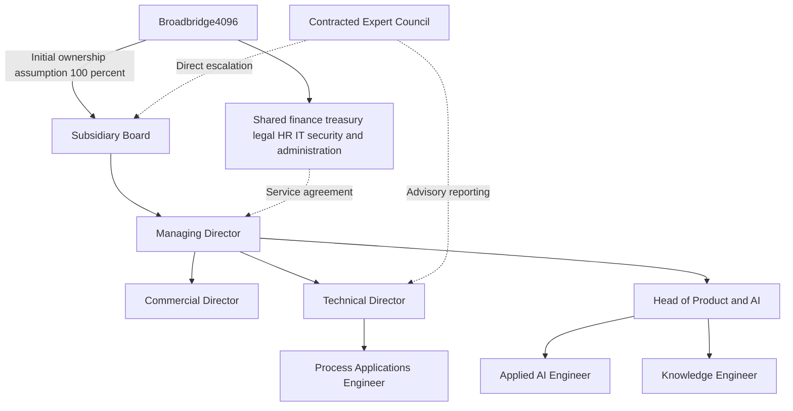

# Broadbridge Oil & Gas subsidiary business assessment

Research and business assessment | 23 September 2026

Updated to the approved subsidiary organizational design. Broadbridge Oil & Gas is a working name; jurisdiction and final legal form remain for subsequent legal implementation.

**Recommendation.** Develop **Broadbridge Oil & Gas** as a dedicated, initially 100%-owned subsidiary of **Broadbridge4096**, combining expert advisory, AI software, training, and knowledge licensing. Serve the full oil and gas value chain through phased expansion, beginning with refinery process troubleshooting and engineering development in one tightly defined equipment family. Distillation and vacuum-system troubleshooting are the strongest initial candidates if Norman Lieberman or a comparably experienced specialist becomes a committed contributor. Fund a bounded customer-validation program before investing in proprietary model training or a broad industrial platform.

The central commercial hypothesis is that a plant will pay for faster, better-supported engineering decisions when an experienced specialist's diagnostic method is available in its daily workflow. That hypothesis requires paid customer testing. An archive, a famous expert, or a fine-tuned model alone does not establish demand or defensibility.

This assessment distinguishes verified public facts, claims in the supplied report, and proposed business assumptions. All prices, budgets, targets, and financial examples below are planning assumptions unless explicitly attributed otherwise. No experts, customers, or publishers have been contacted.

**Scope.** I reviewed the supplied 59-page *Proprietary Data Model Training Report*, concentrating on its technical pipeline, refining pathway, expert-capture plan, commercial applications, pricing, and verification notes. I also inspected its principal diagrams and relevant tables. The corporate review uses the original and Phase 3 Broadbridge organization charts, the Broadbridge business plan, the Phase 3 strategy memo, relevant operating-playbook sections, and the Meridian organization chart from the Energy Trading folder you identified. The Energy Trading documents are organizational references for a commodity business, not an ownership map or a requirement for the subsidiary to serve a trading operation. These are planning documents, not proof of incorporation, committed financing, regulatory authorization, existing contracts, or deployed capabilities. Instructions and approval requests inside them were treated as source content, not directions to execute.

The source folder is accessible through the workspace's [Energy Trading folder link](<C:/Users/bradu/Documents/Broadbridge4096/Energy Trading>), a live Windows junction to [the original OneDrive folder](<C:/Users/bradu/OneDrive/Documents/Claude/Projects/Energy Trading>). Changes made through that folder link affect the original files. This research left those source documents unchanged.

## 1 The opportunity and the initial scope

Lieberman's consultancy describes expertise in continuous chemical plants, refining, and gas processing, with particular specialties in large-diameter distillation towers, vacuum distillation, asphalt production, and delayed coking. Its public business address is in Metairie, Louisiana. This establishes a professional connection to Louisiana, not an independently verified residential address. [Process Improvement Engineering](https://www.lieberman-eng.com/)

His firm's biography describes more than 50 years of experience, extensive seminar teaching, troubleshooting and revamp work. It also identifies Elizabeth Lieberman as a chemical engineer, consultant, and coauthor. The existing video library is aimed at process engineers and experienced operating personnel and is cross-referenced to textbooks. These are useful starting assets and evidence of an established education business; current participation, ownership, availability, and commercial rights remain unconfirmed. [Key personnel](https://www.lieberman-eng.com/personnel.htm), [video library](https://www.lieberman-eng.com/videos.htm)

The best initial customer problem is: **a process engineer has an abnormal equipment condition, incomplete evidence, and limited access to a senior troubleshooter.** The product should help assemble evidence, identify competing explanations, ask the next useful question, and prepare a reviewable diagnostic brief. It should also let engineers rehearse these judgments on historical cases.

Start with distillation and vacuum systems, then expand into adjacent heat-transfer and hydraulic problems only after demonstrating performance. Refining, gas processing, LNG, upstream production, drilling, and subsurface interpretation are different markets with different expertise requirements. Shared terminology is not proof that one expert or one model covers all of them.

| Initial offer | Main buyer | Why it fits | Main limitation | Recommendation |
|---|---|---|---|---|
| Historical-case training and diagnostic rehearsal | Technical training or engineering manager | Uses expert teaching skill; can begin with cleared material | Existing courses and videos are substitutes | Use as an entry offer and evaluation environment |
| Expert-assisted process troubleshooting | Technical services manager or plant engineering lead | Directly uses the expert's distinctive judgment | Review capacity, data access, and liability | Primary commercial hypothesis |
| Generic document search and shift summaries | Operations or digital manager | Clear information-retrieval task | Established software platforms already offer related functions | Supporting capability, not the main proposition |
| Turnaround lessons and scope review | Turnaround manager | Can use expert histories and outcomes | Requires additional specialty coverage and episodic sales | Later module |
| Autonomous operating optimization | Operations and control leadership | Potentially large value | Extensive integration and validation burden | Outside the initial product scope |

An initial product should produce a **diagnostic brief** containing the reported symptoms, applicable equipment context, ranked hypotheses, evidence supporting and contradicting each hypothesis, missing measurements, relevant source passages, checked calculations, and escalation conditions. Plant-authorized personnel retain operational decisions. The first deployment should not issue control-system commands or independently prescribe changes to operating limits.

## 2 What the supplied research gets right and what needs correction

The report is strongest on the importance of tacit knowledge, rights inventory, expert review, outcome records, and comparison against a capable general model using retrieval. Sections 13 and 14 are the most relevant starting points. Its construction-first recommendation reflects a different portfolio context and should not determine the strategy for this expressly oil-and-gas-focused venture.

| Report statement or implication | Assessment | Consequence for this venture |
|---|---|---|
| The engineer's judgment is more valuable than the document pile, pp. 31–36 | Strong framing | Capture how the expert distinguishes plausible causes, especially exceptions and failed hypotheses |
| The 12-stage pipeline passed its smoke test, pp. 29–30 | Evidence of a scaffold, not a validated industrial model | The report describes 34 synthetic logs, a one-document holdout, unreviewed example pairs, a pending endpoint-dependent leakage test, and numerical verifiers still needing implementation |
| A leakage test supports a certificate that data cannot escape, pp. 26, 36, 41 | Assurance is overstated | Report tested attacks and observed results; do not promise universal non-disclosure from a finite test |
| Interview material is unambiguously owned by the engineer; rephrasing addresses copyright, p. 32 | Too broad | Verify publisher, employer, client, coauthor, and confidentiality rights before commercial use |
| Reserved GPUs, fine-tuning, and RL are early necessities, pp. 12, 33–36 | Premature for the proposed first product | Benchmark retrieval, structured case selection, and calculation tools before choosing additional training |
| RefiningGPT demonstrates domain-model value, pp. 13, 52 | Useful, narrowly scoped research evidence | Its diagram-synthesis benchmark is not a test of operational troubleshooting or plant safety |
| Site prices of $250,000–$1 million annually, p. 41 | Explicitly illustrative in the report | These describe a broad bundle; they are not demonstrated willingness to pay for the initial narrow product |
| Data recognition in SNA 2025 creates a corporate balance-sheet destination, pp. 26–28 | Conflates different accounting frameworks | Do not base funding or entity structure on an assumed uplift in recorded asset value |

The RefiningGPT paper does report unit-selection F1 of 0.70 versus 0.55 for its strongest listed general-model comparator. Its dataset contains 500 triplets derived from 20 refinery diagrams. This supports testing specialized methods on narrow tasks; it does not establish field reliability, general superiority over current models, or this venture's economics. [RefiningGPT paper, Tables 1–3](https://arxiv.org/html/2605.19704v1)

There is also a potential evaluation-contamination issue in the report's protocol: it proposes using held-out cases as interview prompts that become training material. Reserve final test incidents before capture and keep their answers, derived examples, and close duplicates out of development and retrieval collections. Split by incident and source, not merely by text chunk.

PSM does not impose a universal rule that every associated document must remain on an OT network. OSHA addresses access to information and trade-secret protections; deployment decisions also depend on contracts, specific data restrictions, and site security architecture. NIST discusses multiple OT and connected-system architectures. The initial business should support a customer-approved environment and read-only exports or mirrors, with on-premises deployment where required. [OSHA PSM standard](https://www.osha.gov/laws-regs/regulations/standardnumber/1910/1910.119), [NIST OT security guidance](https://csrc.nist.gov/pubs/sp/800/82/r3/final)

SNA is a national statistical framework. Corporate recognition of intangible assets is a separate question: IAS 38, for example, distinguishes research expense from development expenditure meeting recognition criteria. A data subsidiary does not itself make an internally estimated data valuation bookable. The applicable accounting framework and facts require an accountant's assessment. [IMF explanation of the updated SNA](https://www.imf.org/en/Blogs/Articles/2025/07/31/new-standards-for-economic-data-aim-to-sharpen-view-of-global-economy), [IAS 38](https://www.ifrs.org/issued-standards/list-of-standards/ias-38-intangible-assets/)

This is a review of the claims material to the business decision, not a reproduction or independent audit of every podcast claim, model listing, or source in the report. The companion software was not executed or certified as part of this assessment.

## 3 Competition and the advantage to prove

There is substantial existing competition. In particular, combining domain experts with AI is already part of incumbent positioning.

| Provider | Relevant publicly described capability | Implication |
|---|---|---|
| Honeywell UOP | Process expertise, digital monitoring, optimization, and training | A new vendor must offer a specific capability or access advantage beyond generic expertise. [UOP refining](https://uop.honeywell.com/en/industry-solutions/refining) |
| Emerson's AspenTech business | Industrial AI and refinery simulation combining domain expertise and engineering models | Integrate with established calculation workflows rather than attempt to recreate them. [AspenTech industrial AI](https://solutions.aspentech.com/en/insights/industrial-ai-from-aspentech?src=seo-cmms-software) |
| AVEVA | Industrial AI Assistant with natural-language search, source citations, and permission-aware access | Citations and document chat alone will not differentiate the product. [Industrial AI Assistant](https://www.aveva.com/en/connect-experience/about-connect/industrial-ai-assistant/) |
| Cognite | Industrial agents supported by contextualized operational data | Avoid building a competing general data platform. Aker BP publicly confirms expanded adoption, although that is upstream evidence. [Atlas AI](https://www.cognite.com/en/product/atlas), [Aker BP announcement](https://akerbp.com/aker-bp-leverages-cognite-atlas-ai-to-pioneer-an-ai-first-future-in-exploration-and-production/) |
| KBC | Refinery consulting, process simulation, and AI combined with plant data | This is a particularly relevant competitor to an expert-led refinery offering. [KBC on refinery AI](https://www.kbc.global/resources/blog/why-most-ai-in-refining-fails-to-scale-and-what-works-in-real-refinery-operations/) |

These sources establish publicly described offerings, not independently measured performance or market share. The customer's internal experts, established consulting relationships, textbooks, courses, and an existing enterprise AI tool are also important substitutes.

The proposed advantage is a combination of rights-cleared, difficult-to-recreate cases; carefully captured diagnostic questions and exceptions; independent expert evaluation; workflow adoption; and a growing record of validated outcomes. Public articles can establish credibility and supply licensed reference material, but competitors can also access public knowledge. Exclusive AI rights cannot be assumed simply because the venture signs the author.

A decisive experiment compares two otherwise equivalent systems: one with the same general model, tools, and public references, and one additionally using the venture's cleared expert cases. If the expert layer does not improve quality, time, or escalation decisions on unseen incidents, the core differentiation remains unproven.

## 4 Build the knowledge asset deliberately

Record cases as structured engineering records rather than a large collection of question-and-answer pairs. Each case should include equipment and service, operating context, symptoms, evidence available at each stage, initial hypotheses, the observation that distinguished them, rejected explanations, calculation assumptions, applicable limits, action authority, observed outcome, uncertainty, reviewer, source rights, and version.

A hypothetical distillation exercise could describe deteriorating separation and changing pressure differential. The assessment would test whether the system requests evidence capable of distinguishing several explanations, recognizes missing context, and knows when to escalate. It should not reward simply guessing a root cause after seeing the outcome. The expert defines the acceptable questions and reasoning for each approved case.

Separate the information into four categories:

| Information category | Commercial treatment |
|---|---|
| Public or licensed reference works | Track ownership and permitted retrieval, quotation, training, and distribution uses separately |
| Newly commissioned expert explanations and cases | Obtain explicit rights to the delivered material; review for embedded third-party confidential information |
| Customer-specific records, trends, and adaptations | Keep within the customer's authorized scope; separate permissions, storage, and access |
| Cross-customer lessons and benchmarks | Create only with explicit reuse rights and review for identification and disclosure risks |

Removing customer names does not necessarily remove trade-secret or contractual restrictions. Federal trade-secret definitions cover technical and engineering information whether or not written down. Similarly, the author's ownership of a book's text may have been assigned or licensed. Copyright protects expression rather than underlying ideas, but rewording is not a substitute for reviewing the actual rights and confidentiality obligations. [18 USC 1839](https://www.law.cornell.edu/uscode/text/18/1839), [Copyright Office on rights transfers](https://www.copyright.gov/help/faq/faq-assignment.html), [Copyright Office on protected expression](https://www.copyright.gov/what-is-copyright/)

Begin with a searchable case library, an explicit equipment and failure-mode taxonomy, retrieval from approved sources, a strong general model, and independently checked calculation tools. Maintain source version and permission controls. Calculations should expose inputs, units, assumptions, and applicability; numerical consistency alone is not proof of engineering correctness.

Fine-tune only when controlled tests identify a recurring behavior or cost problem that it addresses. Keep customer facts and frequently changing procedures in a governed retrieval layer. Model choice should follow the benchmark, operating constraints, and current license terms, not the model rankings or token-count thresholds in the seed report.

The evaluation should cover incomplete evidence, misleading symptoms, invalid instruments, contradictory references, unfamiliar equipment, absent permissions, and unsupported questions. Score appropriate uncertainty and escalation as well as diagnosis. Hallucination, privacy, and evaluation limitations are recognized concerns in NIST's generative-AI risk profile. [NIST AI 600-1](https://nvlpubs.nist.gov/nistpubs/ai/NIST.AI.600-1.pdf)

## 5 Expert participation and continuity

Offer a paid founding-expert engagement with defined capture sessions, review deliverables, commercial-use rights, and renewal terms. Separate compensation for ongoing work from consideration for the rights to existing material. A retainer plus module-related royalties and potentially vesting equity can align incentives, but none of those terms should be presumed agreed.

The agreement should address:

- Exactly which works and new deliverables are covered, including coauthor and publisher permissions.
- Rights for retrieval, embeddings, model training, evaluation, customer delivery, and approved sublicensing.
- Any exclusivity by subject area, product, duration, and performance condition, with ordinary teaching and consulting addressed explicitly.
- Expert approval of attributed material and corrections; clear identification of AI-generated and human-reviewed outputs.
- Approved use of name and likeness, distinct from a claim of live personal endorsement.
- Ownership or durable licenses for new cases, software, annotations, and derivative datasets.
- A defined royalty base and treatment of bundles, channel sales, discounts, and multiple contributors.
- Continuity if a contributor becomes unavailable, retires, dies, or terminates participation; existing customer rights and estate payments need explicit treatment.

Start with one lead expert, one independent reviewer, and a knowledge engineer who can translate field experience into usable records. Add complementary specialists as the product scope expands. The independent reviewer should challenge the founder's interpretations rather than simply authenticate attribution. Do not assign every new specialty to the founding expert by default.

## 6 Market and initial customer selection

EIA's January 1, 2026 inventory reports 130 operable US refineries, including 128 operating and two idle facilities. Louisiana has 15 operating refineries and Texas 34. These are facility counts, not separate buyers or a qualified sales pipeline. [EIA 2026 refinery capacity, Table 1](https://www.eia.gov/petroleum/refinerycapacity/table1.pdf)

The concentration supports starting with Gulf Coast relationships, subject to the expert's actual network. Prioritize a site with an engaged technical-services sponsor, relevant recurring equipment problems, usable historical cases, an approved data route, and budget for a scoped pilot. Build an initial list of 10–15 accounts and interview 8–12 prospective users and budget owners. Those are proposed discovery targets, not existing prospects.

EIA's individual-refinery inventory can seed the account list and identify equipment fit. It includes Louisiana facilities such as Chalmette, Port Allen, Garyville, Lake Charles, and Meraux. Their inclusion is not evidence that the operators want this product or have an unmet need. [EIA individual refinery capacity, Table 3](https://www.eia.gov/petroleum/refinerycapacity/table3.pdf)

Use bottom-up sizing. For illustration, 49 Louisiana and Texas sites at $120,000 each would equal $5.88 million annually if every site purchased; all 130 US sites at that price would equal $15.6 million. These are arithmetic reference ceilings for a single product at an assumed price, not realistic addressable-market or revenue forecasts. Shared procurement, unsuitable units, existing contracts, and adoption constraints reduce the reachable market.

A substantial business therefore likely requires either deeper value per site, international customers, or carefully validated extensions into gas processing and petrochemicals. A profitable specialist company may be feasible without a venture-scale market; the capital strategy should reflect that distinction.

## 7 Commercial model and economics to test

Sell a paid, bounded engagement first: a case library and diagnostic workflow for one equipment family, a limited user group, agreed historical evaluation, and a defined allowance for human review. Separate customer implementation fees, subscription fees, and professional consulting. Training can introduce the product and reveal user needs, but course participation is not proof of willingness to buy operational software.

| Offer | Proposed price to test | Scope boundary |
|---|---|---|
| Case-capture and diagnostic pilot | $40,000–$75,000 over roughly 8–12 weeks | One equipment family, limited users, agreed records, capped expert review |
| Initial annual site product | $75,000–$150,000 | Validated module, updates, training exercises, limited support |
| Site integration or custom case development | Separately scoped fixed fee | Prevent bespoke setup from consuming recurring margin |
| Complex expert consulting | Separate statement of work | Defined responsibility, staffing, deliverables, and insurance |

These are founder planning hypotheses, not surveyed market prices. Test them with budget owners. The pilot may help fund delivery without covering the full cost of building the reusable product.

**Expert capacity is the key economic variable.** Consider a hypothetical $120,000 annual site subscription, a 10% content royalty allocation, $12,000 annual hosting/support allocation, and expert labor costing $250 per hour. The royalty rate is an example, not a proposed agreed term.

| Expert service per site | Annual expert labor | Total illustrative delivery cost | Gross contribution | Gross margin |
|---|---:|---:|---:|---:|
| 5 hours/month | $15,000 | $39,000 | $81,000 | 67.5% |
| 15 hours/month | $45,000 | $69,000 | $51,000 | 42.5% |
| 30 hours/month | $90,000 | $114,000 | $6,000 | 5.0% |

This simplified calculation excludes acquisition costs, general R&D, overhead, taxes, and initial implementation. It shows why repeat questions must become reusable reviewed cases and why subscriptions need explicit human-service limits. Charging more cannot be assumed to fix high service costs.

Customer value also needs disciplined measurement. Twenty engineers saving one hour each week for 48 weeks at an assumed loaded value of $150/hour produce $144,000 in annual capacity value. That alone gives limited headroom for a $120,000 subscription plus setup costs. Saved time is not automatically cash savings. Additional value from faster problem resolution, energy efficiency, or throughput needs site-specific evidence and should not be counted twice. Avoid treating an unobserved avoided accident as a bankable pilot benefit.

As a revenue-scale illustration, ten sites at $120,000 equal $1.2 million annual recurring revenue once all are active for a full year. That is not a year-one revenue forecast and excludes service revenue. At 15 expert hours per month per site, those ten sites already require 150 monthly expert service hours, before content creation and review.

## 8 Broadbridge4096 subsidiary structure

**Broadbridge4096 is the explicit parent.** Establish Broadbridge Oil & Gas as its dedicated subsidiary, initially assuming 100% parent ownership. The business will own its customer delivery, product priorities, expert relationships, and operating results. Incorporation jurisdiction and final legal form remain a subsequent legal implementation decision. This organizational design does not presume that an entity has already been incorporated or that financing, appointments, or contracts have been executed.

The Energy Trading organization charts, business plan, strategy memo, and operating playbook supply examples of reporting lines, oversight, shared functions, and disciplined operating processes. Their trading desks, international entities, merchant financing, tax assumptions, and headcounts do not carry into this design. The subsidiary is an adjacent expert-services and product business serving its own external customers. [Original organization chart](<C:/Users/bradu/OneDrive/Documents/Claude/Projects/Energy Trading/Broadbridge_4096_Org_Chart.docx>), [Phase 3 organization chart](<C:/Users/bradu/OneDrive/Documents/Claude/Projects/Energy Trading/Broadbridge_4096_Org_Chart_Phase3_Agentic.docx>)

The seven employee positions are the Managing Director, Commercial Director, Technical Director, Process Applications Engineer, Head of Product & AI, Applied AI Engineer, and Knowledge Engineer. Expert Council members and independent reviewers are contractors. Parent shared-service personnel and board participation are outside dedicated employee totals. Norman Lieberman remains an **illustrative founding expert candidate**, without an implied appointment, endorsement, or agreed license.

### Practices and offerings

| Practice | Sequence and scope |
|---|---|
| Downstream and Petrochemicals | Launch in refining, process troubleshooting, equipment performance, and operating knowledge. The Technical Director leads the practice initially. |
| Gas Processing and Midstream | Subsequent expansion into treatment, compression, processing, LNG-related operations, and facilities with a dedicated practice lead and suitable experts. |
| Upstream Production and Facilities | Later expansion with its own specialists. Drilling and subsurface services require separately demonstrated capability. |

Each practice can sell four offerings within its accepted technical scope: advisory engagements, recurring software subscriptions, training programs, and licensed expert knowledge. Commercial and product teams serve the practices across the subsidiary. A practice is not a separate legal entity under this design.

### Decision rights and shared services

| Decision | Accountable owner | Boundary |
|---|---|---|
| Capital allocation, annual budget, senior appointments, equity changes, material IP transactions | Broadbridge4096 | Subsidiary Board recommends and oversees execution. |
| Customer commitments and operating execution | Managing Director | Within a written delegation; route commitments to the parent through the board until limits are approved. |
| Technical scope, acceptance, and suspension | Technical Director | May stop unsupported or unsafe deliverables; independent review is required for material technical work. |
| Product implementation and release | Head of Product & AI | Release requires Technical Director acceptance and acceptance by the designated parent IT security lead. |
| Customer delivery | Technical Director at launch; Delivery Lead after appointment | One accountable delivery owner per engagement, with a documented transition. Technical acceptance stays with the Technical Director. |
| Independent review findings | Assigned independent reviewer | Reviewers cannot certify their own authored material or implementation. |

The Expert Council reports to the Technical Director with direct escalation to the Subsidiary Board. It advises on domain coverage, methods, evidence, and limitations; membership provides no management or signing authority. Commercial deadlines cannot override technical or security stops.

Broadbridge4096 supplies finance, treasury, legal, HR, IT security, and corporate administration through defined service arrangements. Each arrangement identifies service owners, service levels, charges, access boundaries, and escalation. The Managing Director owns the subsidiary service relationship and P&L. Parent access to customer data follows permissions and operational need, not ownership alone.

### Expert participation and IP responsibilities

Use expert retainers, scoped fees, and licensing arrangements. Equity is a separate parent decision. Expert contracts must define background content, new case ownership or license, permitted uses, attribution, compensation, review duties, conflicts, continuity, and termination rights. Public availability or authorship does not establish all commercial rights.

Separate the three asset classes. Experts or actual rights holders retain pre-existing content unless expressly assigned; the subsidiary obtains specified licenses. New subsidiary-funded software should be assigned to the subsidiary through employment and contractor agreements, while parent or third-party components require licenses. Customers retain their contractual rights in supplied data; permission to deliver a project does not authorize general model training, publication, or cross-customer reuse.

The Knowledge Engineer maintains source and rights records. The Head of Product & AI maintains software records and enforces access restrictions. The Technical Director accepts technical content. The Managing Director approves contractual permissions within delegation on legal advice; material IP transactions remain parent reserved matters. Any potential reuse of parent or affiliated platforms requires diligence on ownership, support, cost, security, and sublicensing rather than an assumed transfer.

### Staffing stages

| Function | Launch | Expansion | Mature target |
|---|---:|---:|---:|
| Managing Director | 1 | 1 | 1 |
| Commercial | 1 | 2 | 3 |
| Technical practices | 2 | 4 | 7 |
| Product, AI, and knowledge engineering | 3 | 4 | 6 |
| Dedicated delivery and customer success | 0 | 2 | 4 |
| Dedicated academy team | 0 | 0 | 2 |
| Subsidiary business operations | 0 | 0 | 1 |
| **Dedicated employees** | **7** | **13** | **24** |

Launch staff cover delivery and training. Contractors and shared services are additional resource arrangements, not hidden employees within these totals. Expansion requires repeatable paid deployments, funded staffing, and a paid customer mandate for every new practice. The mature structure is a destination, not an immediate hiring commitment.

The editable [subsidiary organizational chart](C:/Users/bradu/Documents/Broadbridge4096/output/docx/Broadbridge_Oil_and_Gas_Organizational_Chart.docx) and [business and operating structure](C:/Users/bradu/Documents/Broadbridge4096/output/docx/Broadbridge_Oil_and_Gas_Business_and_Operating_Structure.docx) define reporting lines, exact future role mixes, governance, delivery workflow, and performance ownership. The original reference documents and Energy Trading folder link remain unchanged.

## 9 A 90-day validation program

The timing assumes expert availability and timely data permission. Customer procurement can extend it. The earlier $150,000–$250,000 validation envelope is an illustrative hypothesis for a bounded prototype program, not an approved operating budget or a fully costed estimate for seven dedicated employees. Build a separate parent-approved cash plan using actual compensation assumptions, hiring dates, expert retainers, independent review, shared-service charges, infrastructure, working capital, and contingency before authorizing launch staffing.

| Period | Work | Evidence required before increasing investment |
|---|---|---|
| Days 1–15 | Confirm founding expert scope and rights; interview users and budget owners; select the equipment family | A credible rights path, named customer sponsor, repeated problem, baseline and paid pilot scope |
| Days 16–40 | Conduct structured capture; curate roughly 40–60 development cases; build a retrieval and tool baseline | Traceable rights, expert-reviewed records, useful prototype, and a separately reserved evaluation set |
| Days 41–65 | Test historical cases, obtain independent ratings, fix known failures, compare to an equivalent general-model baseline | Roughly 30–50 unseen incidents or exercises with documented coverage; no mixing of their answers into development |
| Days 66–90 | Limited user pilot under approved controls; measure use, task time, corrections, and expert effort; present renewal proposal | Willingness to pay, observed workflow benefit, manageable service costs, and a defined rollout decision |

The case counts are scope targets. If the available distinct incidents are fewer, report that limitation and reduce the strength of conclusions instead of inflating the set with paraphrases. Public teaching cases can test workflow but should not be treated as proof of novel diagnostic reasoning by a model that may have encountered them previously.

Pre-agree the pilot acceptance rules with the customer. Suggested targets for discussion are a 25% reduction in time to prepare an expert-reviewed diagnostic brief; independently rated output quality at least as good as the existing process; a documented gain attributable to the expert library over the same model without it; and no critical unsafe recommendation in the agreed adversarial test set. Passing a finite test does not prove safety for all future situations.

Commercially, require a credible renewal path and evidence that expert service hours can fall toward a sustainable level. Track coverage, reviewer corrections, unsupported claims, missing evidence, and escalation appropriateness. Count pilot fees and recurring commitments separately from expressions of interest.

Pause expansion if rights cannot be established, buyers will only pay for individual consulting, performance does not improve over the baseline, or delivery requires uneconomic expert attention. A narrower expert-services business could still be worthwhile, but should be priced and financed as such.

## 10 Implementation decisions still needed

The adopted organizational design identifies Broadbridge4096 as parent, assumes initial 100% ownership, sets a seven-person launch team, and defines the 13- and 24-person staffing stages. Those are planning decisions, not evidence of legal formation, completed hiring, or capital commitment.

The next material inputs are the present relationship with Lieberman and other candidate experts; the content and client histories they can license; paid design-customer mandates; a costed staffing and cash plan; and written decision limits. Complete expert and software rights agreements, customer-data permissions, and the shared-service arrangements before deployment. Jurisdiction, final legal form, and any applicable professional-service authorizations remain legal implementation decisions.

The first investment decision should turn on **a committed expert, a usable rights package, and a paying customer with a measurable problem**. The Managing Director owns the investment recommendation, the parent approves capital and budget, and the Technical Director owns technical acceptance. Model training remains a subsequent engineering choice supported by evaluation results.
