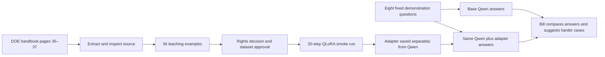

# Bill's first Qwen training demonstration

Prepared 30 September 2026 UTC. **The training package exists; the model has not been trained on it.** No before/after answers or reviewer scores have been generated.

Bill, the aim is to show the complete teaching loop on a small, understandable task, then get your judgment about where it would be useful. The first task is checking pressure references in engineering notes: psig versus psia, positive vacuum depression, and what to ask when information is missing.

Qwen already knows a great deal, including basic arithmetic. Fine-tuning may help make its responses consistent with a chosen checking procedure and answer format. This exercise will show whether the mechanics work; it might show little improvement on questions the base model already answers well. We will show failures and regressions alongside good answers.

## What we would show in a 10–15 minute meeting

1. **The source and one example.** Open the [DOE handbook at PDF page 35](https://www.energy.gov/sites/default/files/2026-04/DOE-HDBK-1012-92_VOL1.pdf#page=35). We retain the original, page references and checksum. This demonstration uses three pages, not the entire handbook or Bill's private files.
2. **What the model is being taught.** A question, available evidence and a desired answer form one example. Only the assistant's answer contributes to training loss. Missing-data and abstention examples teach when a numerical answer is unsupported.
3. **The training result, once authorized and run.** Show actual optimizer steps, losses and a saved adapter. The adapter is a separate set of learned changes; the base checkpoint is retained. A loss graph or saved file proves execution, not engineering competence.
4. **The same eight questions before and after.** Use the same checkpoint, quantization, prompts, evidence and decoding settings. Show the full set with source references. Model outputs remain blank until the real runs happen.
5. **Your feedback.** Identify useful behavior, mistakes and the harder cases worth collecting next. Your contribution is the judgment about assumptions, consequences and unusual situations that a handbook cannot supply.

## Examples Bill can review now

These are authored reference expectations, **not observed model answers**.

| Input | Expected behavior | Why it matters |
| --- | --- | --- |
| Local atmosphere 13.2 psia; gauge reading 27.4 psig | Explain the basis and return 40.6 psia | Avoid mixing pressure references |
| Gauge reading −1.4 psig; local atmosphere 14.6 psia | Return 13.2 psia without confusing negative gauge with negative absolute pressure | Handle a sign mistake |
| A note says only “25 psi” | Ask for the pressure basis and, if needed, the relevant atmospheric reference | Avoid inventing missing facts |
| Only a pressure definition is available; is a reactor at 55 psig safe? | Explain why this cannot establish safe operation | Avoid unsupported operating advice |

The numerical tolerance is ±0.05 psi for these rounded educational answers; it is not instrument accuracy or a plant operating tolerance. Hydrostatic depth calculations, water/mercury conversion recipes, diagrams and equipment design remain outside this exercise.

## What to ask Bill

- Would checking pressure bases save time or catch meaningful errors in your work? If not, what specific task should replace it?
- What information do experienced engineers always request that a junior engineer commonly misses?
- What is a convincing but dangerous wrong answer for that task?
- Which anonymized case would expose a limitation that a straightforward handbook example would miss?
- What would you need to see before using an assistant's draft in a real review, and which decisions must stay with the engineer?

After the meeting, capture priorities in **A · Your workflow / A8** and cases at [Broadbridge Case Capture](https://broadbridge-capture.vercel.app). Bill's actual signature and comments remain his to provide; this package records Brad's assumption of agreement for preparation, not a signature from Bill.

## Limits and current state

All 36 candidates and eight probes share one DOE handbook family. The 24 calculation examples are variants of two recipes, not 24 independent cases. The comparison therefore measures behavior on the taught task; it cannot demonstrate generalization to new facilities or certify engineering quality. The previous pressure diagnostic set also loses independent-test eligibility if this family is trained. Independent source families and Bill's unseen cases are needed for those claims.

**Current state:** local preparation and token checks complete; rights TBD, source-use decision and bounded execution approval outstanding. Nothing has been sent to Bill, run on AWS, published to the capture app or admitted to a training release by this preparation.

Operator details: [DOE demo package runbook](DOE_TRAINING_DEMO_PACKAGE.md).
