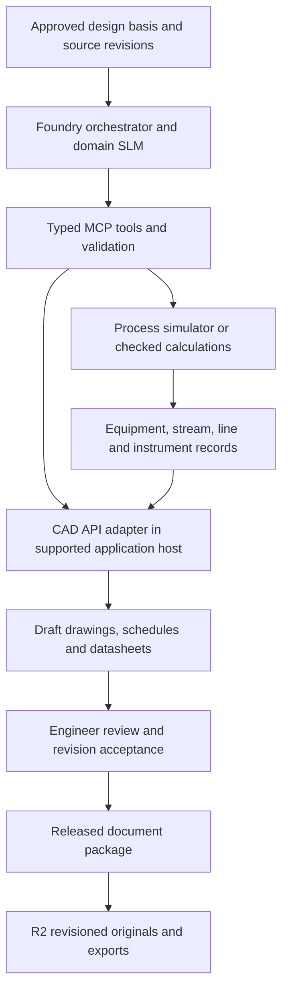

# Petrochemical design tools and Foundry integration options

Research checked 26 September 2026. This is an options assessment, not an
installation, procurement decision or authorization to modify engineering files.

**Recommendation:** evaluate AutoCAD Plant 3D as the first document-authoring
connector if Broadbridge has no incumbent platform. Use the customer's existing
AVEVA, Smart 3D or Bentley environment when project standards require it. Pair the
CAD connector with a process-calculation service. Qwen proposes structured work;
the engineering software calculates and creates native deliverables.

## Main options

| Package | Appropriate work | Documented integration and limits | Broadbridge fit |
| --- | --- | --- | --- |
| Autodesk AutoCAD Plant 3D, including P&ID | Intelligent P&IDs, tagged plant objects, piping models and associated drawing/report workflows | Plant SDK extends ObjectARX; P&ID API is part of the Plant SDK. Use C#/.NET and supported Plant project/data APIs. Native operations need a compatible installed application/session and version-specific SDK verification. | Strong first pilot for a bounded P&ID/equipment-list workflow; my recommendation, not a measured procurement result. |
| AVEVA E3D Design / Unified Engineering | Coordinated process-plant design, 3D models and engineering deliverables; schematic capabilities depend on the selected product modules | PML and .NET APIs support customization. AVEVA's documentation describes access to the database session, geometry and drawing context. The documented in-process pattern is not a generic headless REST service. | Prefer where an EPC or customer already has AVEVA projects, catalogues and standards. |
| Intergraph Smart 3D / Smart P&ID | Enterprise plant models and intelligent P&IDs across separate connected products | Smart 3D Plant Web API is REST/OData; documented operations include entities, reports/deliverables, updates and position/orientation actions. These do not establish unrestricted topology creation or Smart P&ID write access; check the particular product/API entitlement. | Strong enterprise integration target when existing owner/EPC data lives here. |
| Bentley OpenPlant PID / OpenPlant Modeler, with iTwin | Intelligent schematics, plant modeling and shared engineering information | OpenPlant PID documents iTwin/PlantSight integration. iTwin offers APIs/SDKs for shared model/data services. Read/coordination access through iTwin is not equivalent to native OpenPlant authoring; validate the installed product's customization interface for write operations. | Good where Bentley, DGN and iTwin workflows are already standard. |
| DWSIM, complementary to CAD | Flowsheets, heat/material balances and calculated stream/equipment results | Open-source simulator with documented .NET/COM automation. Interfaces support creating, loading, calculating and saving flowsheets; COM is Windows-specific. Its simulation diagram is not a fabrication-ready P&ID. | Useful low-cost integration experiment for deterministic calculations feeding the CAD document set. |

Primary references:

- [Autodesk Plant 3D and P&ID API](https://forge.autodesk.com/developer/overview/autocad-plant-3d-and-pid),
  [SDK downloads](https://aps.autodesk.com/developer/overview/autocad-plant-3d-objectarx-sdk-downloads),
  [intelligent P&ID creation with C#](https://www.autodesk.com/support/technical/article/caas/sfdcarticles/sfdcarticles/Autodesk-AutoCAD-Plant-3D--How-to-Insert-P-ID-Tool-Palette-Symbols-Using-C-Sharp.html).
- [AVEVA E3D](https://www.aveva.com/en/products/e3d-design/),
  [E3D datasheet: PML and .NET](https://www.aveva.com/content/dam/aveva/documents/perspectives/datasheets/Datasheet_E3DDesign.pdf),
  [documented PMLNet integration pattern](https://help.aveva.com/AVEVA_Everything3D/1.1/NCUG/NCUG5.6.3.html).
  The last reference is an older API guide; confirm details against the installed E3D release.
- [Smart 3D Plant Web API, v14](https://docs.hexagonppm.com/r/en-US/Intergraph-Smart-3D-Plant-Web-API-Programmers-Reference/14/892710).
- [OpenPlant PID datasheet](https://www.bentley.com/wp-content/uploads/PDS-OpenPlant-PID-LTR-EN-HR.pdf),
  [Bentley iTwin API/SDK quickstart](https://developer.bentley.com/tutorials/quickstart-web-and-service-apps/).
- [DWSIM automation](https://dwsim.org/wiki/index.php?title=Automation),
  [current automation interface](https://dwsim.org/api_help/html/T_DWSIM_Automation_AutomationInterface.htm).

Aspen HYSYS/Aspen Plus would also be candidates when a customer's simulation
models already use them. Their particular automation interfaces, installation
and licence entitlements need a separate check. They should be evaluated as
process simulators feeding the CAD workflow, not as replacements for plant CAD.

## MCP: what is available and what must be built

Autodesk now documents official MCP servers. Its AutoCAD/Civil 3D server is a
Windows local tech preview for **Autodesk Assistant**: AutoCAD exposes reading and
analysis; Civil 3D exposes additional writes. It does not establish that our
external Qwen/Foundry client can author intelligent Plant 3D objects. Autodesk
also lists Fusion and Revit MCP options, but their capabilities do not prove
support for petrochemical P&ID topology.
[Autodesk MCP catalogue](https://help.autodesk.com/view/ADSKMCP/ENU/) and
[AutoCAD/Civil 3D access limits](https://help.autodesk.com/view/ADSKMCP/ENU/?guid=ADSKMCP_AutoCADCivil3DMcp_autodesk_autocad_civil_3d_mcp_html).

For the proposed plant workflow, a custom MCP server wrapping a supported vendor
API remains the concrete integration route to test. MCP standardizes the tool
interface; it does not supply a CAD licence, missing vendor API operations,
engineering validation, or a model's ability to use the tools correctly.
Expose a small set of typed operations, for example:

- Read a drawing revision, equipment tags, line records, instrument properties
  and connectivity.
- Run a named, approved calculation with explicit units, pressure basis,
  composition, property package and solver convergence report.
- Create a draft document from an approved template and a validated data package.
- Compare the proposed tag/property/topology changes with the source revision.
- Export a reviewed drawing or equipment/line/instrument schedule.

Avoid a generic “execute arbitrary CAD code” tool. Use supported application
transactions for modifications and never treat a direct project-database edit as
equivalent to a supported drawing operation. A Plant 3D .NET bridge should run in
the licensed application context; confirm API threading/locking and support for
each proposed operation. APS cloud AutoCAD automation exists, but Plant 3D
vertical-object support must be verified rather than assumed from the generic
AutoCAD engine. [APS automation overview](https://aps.autodesk.com/automation-apis).

## Proposed architecture

R2 stores native project snapshots/exports and the generated deliverables. It
does not run CAD. Neon can track document IDs, revision links, source references,
units, approval status and execution receipts. A CAD host is a separate licensed
application environment; the existing Linux CPU Docker extraction worker cannot
be assumed to run a Windows desktop CAD stack.

Use structured equipment/stream/line/instrument records as the interface. The
authoritative geometry and project relationships stay in the CAD application.
DWG/DGN/PDF/IFC exports can serve viewing/exchange purposes, but their presence
alone does not guarantee round-tripping intelligent tags and connectivity. Use
the native API where available and preserve vendor object IDs plus revision IDs.

## First demonstrator to specify

Use a synthetic pump-and-heat-exchanger subsystem, not a live plant project:

1. Engineer supplies design basis, equipment duties, fluid assumptions and
   approved symbol/tagging/document templates.
2. Import a known native drawing/project; read equipment tags and line
   connectivity and verify that the API sees the same objects as the engineer.
3. Run checked calculations or a validated simulator case, preserving all
   assumptions and convergence results. Never substitute plausible SLM numbers.
4. Generate an equipment list, line list, preliminary datasheets and one draft
   P&ID using native intelligent objects.
5. Verify tags, connections, units, drawing readability, native reopen and
   export; compare proposed changes to the original revision.
6. Engineer accepts or rejects the draft. Only accepted revisions could later
   become training/evaluation examples under the existing rights/family gates.

Start with the document graph and one P&ID. Full 3D pipe routing, detailed stress
analysis, fabrication isometrics and issued-for-construction packages are larger
separate scopes. A readable drawing is not proof of a correct engineering design.

This can start as a tool-enabled workflow before additional fine-tuning. Later,
approved examples can teach Qwen the document schemas, clarification behavior and
tool-selection patterns. CAD files themselves are not dropped into text SFT:
derive tagged object/connectivity records and source-linked review tasks; keep
image/geometry evaluation as a separate capability.

Before selecting a package, establish which systems the first engineers/customer
already use, required native deliverables, available licences/API access, and
whether the first business need is P&ID assistance, data consistency checking or
3D layout. Those determine the connector more than a generic feature ranking.
