# Ingestion delivery index — 25 September 2026

The authenticated [public-document scoring page](PUBLIC_REVIEW_URL.md) links fixed source/question/answer review into the capture workflow, with separate reviewer records and CSV export.

Offline implementation is complete and independently reviewed. All pull requests
remain drafts. Live setup has started: migration 0005 is applied to the verified
Neon `dev` branch, with unchanged capture row counts at migration time. A private
`broadbridge-dev` bucket and exact-origin CORS are now configured; synthetic live
R2 uploads and local Docker extraction have run. No merge, production migration,
engineering model inference or EC2/GPU operation was performed. A separate
synthetic-only OpenRouter study is linked below. Preview infrastructure
now has 19 passed R2/Docker/Neon checks and six passed HTTPS checks after Brad's
credential update. The Preview auth-origin mismatch is fixed and Brad's normal
sign-in is verified. Brad then uploaded both prepared synthetic files manually;
live browser-to-dataset acceptance passed, including separate reviews, repeatable
release construction, revocation and stale-review rejection. The temporary
runtime is stopped after completion. See the
[live setup record](INGESTION_LIVE_SETUP.md).

## Plans and operating instructions

- [Architecture](R2_INGESTION_AND_TRAINING_PIPELINE_DESIGN.md)
- [Domain implementation plan](plans/2026-09-25-ingestion-domain.md)
- [Domain bridge and migration runbook](INGESTION_PIPELINE_RUNBOOK.md)
- [Repeatable browser acceptance and deployment handoff](INGESTION_ACCEPTANCE.md)
- [Live setup, verified targets and remaining access](INGESTION_LIVE_SETUP.md)
- [OpenRouter/Jev model selection research](OPENROUTER_MODEL_SELECTION.md)
- [Implemented public/synthetic OpenRouter helper and runbook](OPENROUTER_INTAKE_RUNBOOK.md)
- [Expert-guided synthetic-data workflow and responsibilities](SYNTHETIC_EXPERT_WORKFLOW.md)
- [Synthetic subproject tasks and dependencies](superpowers/plans/2026-09-26-synthetic-expert-data.md)
- [Blank expert recipe and candidate-review worksheet](templates/SYNTHETIC_EXPERT_REVIEW.md)
- [Generic engine operator guide](https://github.com/bHBeachsider/slm-foundry/blob/codex/foundry-ingestion-acceptance/docs/INGESTION_PIPELINE.md)

```mermaid
flowchart LR
  A[Private incoming objects] --> B[Registered source hash and durable job]
  B --> C[CPU extraction and classification]
  C --> D[Normalized evidence and source locations]
  D --> E[Source rights and candidate technical review]
  D -. Planned synthetic subproject .-> K[Expert recipes and bounded candidate generation]
  L[Human-scored development failures] --> K
  K --> M[Evidence and independent calculation checks]
  M --> E
  E --> F[Approved immutable dataset batch]
  F --> G[CPU audit and bounded compute authorization]
  G --> H[Qwen fine-tuning]
  H --> I[Comparable engineering evaluation]
  I --> J[Approved model release and rollback]
```



Uploading queues extraction, not training. The implemented Qwen3-8B path trains
on text examples extracted from multimodal inputs. Native vision/audio training
requires a later compatible model/processor/evaluation extension. Scanned-image
and transcription adapters require separately installed local model artifacts.

## Draft review order

These are verified implementation/acceptance revisions. Final reporting-only
commits may advance a draft; `gh pr view` provides its current full head.
Squash-merge only after Brad marks drafts ready, then retarget/rebase dependent
drafts in order and rerun checks. Nothing goes directly to main/master.

| Foundry draft | Package | Recorded head |
|---|---|---|
| [#1](https://github.com/bHBeachsider/slm-foundry/pull/1) | Plan, based on existing Gate 1 branch | ecd98d28784cdc7e73843cdebaa3a7f3a564d2b4 |
| [#2](https://github.com/bHBeachsider/slm-foundry/pull/2) | Contracts, immutable stores, durable jobs | 2fedb7671fe6f7aae323638fa173df3293e44f34 |
| [#3](https://github.com/bHBeachsider/slm-foundry/pull/3) | Curation and immutable datasets | 1a5e1792e14188900e616262eb7e7b0cf4d58b89 |
| [#4](https://github.com/bHBeachsider/slm-foundry/pull/4) | Extraction and provenance | 5a44dfb41e3766f999bc8ce59d3701b7d454e804 |
| [#5](https://github.com/bHBeachsider/slm-foundry/pull/5) | CPU worker and R2 event transport | eb63025dc0d79b4d0b9b9c0edc6aeb0fd679cb6c |
| [#6](https://github.com/bHBeachsider/slm-foundry/pull/6) | Bounded training and accepted model releases | fb0735f21d66b30d835c9c313d70e339a61d7614 |
| [#7](https://github.com/bHBeachsider/slm-foundry/pull/7) | CI, rehearsal and operator handoff | b2b57b88bdd21e1050390abd0c0cbd0bc4176826 |
| [#8](https://github.com/bHBeachsider/slm-foundry/pull/8) | CLI HTTP domain error correction, after #7 | 877d43c |

| Broadbridge draft | Package | Recorded head |
|---|---|---|
| [#1](https://github.com/bHBeachsider/Broadbridge4096/pull/1) | Earlier capture/database/batch prerequisite | 912ee869f37a041ac24c32aed8c55987ed305ebb |
| [#2](https://github.com/bHBeachsider/Broadbridge4096/pull/2) | Domain plan | 9e6b5e7df30dd026ae8bfbe7129108970293d3ec |
| [#3](https://github.com/bHBeachsider/Broadbridge4096/pull/3) | Domain policy, migration and dataset bridge | af63a0c5e4d5de0c77b207870b1c2c79f32a94dd |
| [#4](https://github.com/bHBeachsider/Broadbridge4096/pull/4) | Source intake and review UI | 65a95f14edb3d747476ba8889b61f2b17d71b589 |
| [#5](https://github.com/bHBeachsider/Broadbridge4096/pull/5) | Browser-to-dataset acceptance and handoff | b0351a34dba76c27696da3811432ce88aa35b1f6 |
| [#6](https://github.com/bHBeachsider/Broadbridge4096/pull/6) | Live dev setup and follow-up evidence | Reporting branch; use `gh pr view 6` for current head |

PR numbers belong to a repository. From `bb1` or any directory, use explicit
repository arguments and omit watch mode:

```powershell
gh pr checks 7 --repo bHBeachsider/slm-foundry
gh pr checks 5 --repo bHBeachsider/Broadbridge4096
gh pr view 7 --repo bHBeachsider/slm-foundry --json headRefOid,isDraft,baseRefName
```

Early Foundry drafts have no hosted workflow individually; the final cumulative
draft carries CPU CI. Broadbridge's Vercel build check is not a database or
write-capable acceptance test.

## Verified results

- Foundry hosted CI: 473 Python tests passed, 1 optional parser host check skipped;
  standalone synthetic rehearsal passed; Cloudflare and CPU container jobs passed.
- Subsequent CLI HTTP fix: 47 focused tests passed; full local CPU suite recorded
  473 passed and 2 skips. Independent specification and quality reviews passed.
  Foundry #8 subsequently passed all three hosted CI jobs. This is separate from
  the preceding hosted CI result.
- Updated live credentials: 19 actual R2/Docker/Neon checks and six HTTPS checks
  passed. Two synthetic sources added; existing capture cases remained unchanged.
- Deployed browser acceptance: two further synthetic files uploaded by Brad,
  both CPU jobs succeeded, original/artifact hashes and authenticated actor
  verified, one synthetic candidate admitted only after separate reviews, and
  a one-row immutable release built twice with identical results. Revocation
  blocked new admission; stale rights updates were rejected. Existing release
  history and all four capture cases remain intact. See
  [live browser/dataset evidence](verification/ingestion-live-browser-dataset.json).
- Domain: 56 independent real PostgreSQL tests, 277 offline pack tests and 1
  migration/checksum test passed.
- Capture: 125 unit tests passed with 8 database-gated skips; TypeScript/build
  passed. Actual PostgreSQL repository tests: 2 passed. Expanded browser flow:
  1 passed. Harness isolation regressions: 3 passed.
- Browser acceptance produced 2 succeeded extraction jobs and 1 immutable dataset
  with one reviewed synthetic training row. Independent verification matched its
  hashes. Synthetic training-control tests use fabricated adapter tensors and
  scores; they do not establish Qwen quality or a successful GPU training run.

## Live execution sequence

1. Neon `dev` and the existing `broadbridge-capture` Vercel project are identified.
   The private `broadbridge-dev` test bucket exists and Brad approved local Docker.
   Dev database authentication and Preview email configuration are repaired.
   The scoped R2 key now passes PUT; the test Preview was refreshed and reached
   READY. Human sign-in and the synthetic browser-to-dataset test are now
   complete. Temporary runtime is stopped. A new upload session still needs a
   bounded API/worker and refreshed Preview connection.
2. Migration 0005 is applied and read back on `dev`. Provision event/worker wiring.
   Real signing/CORS, restart recovery and synthetic review/revocation have been
   verified. Automatic Cloudflare event transport remains a separate live gate.
3. Install and verify licensed local parser model artifacts for OCR/transcription.
4. Admit real rights-cleared documents and signed cases, prepare reviewed examples,
   freeze a batch, and run a CPU token audit. Establish comparable engineering baselines.
5. Approve explicit GPU steps/time/budget and host prerequisites, run QLoRA, evaluate,
   and promote only after acceptance. No automatic training or production promotion.

Vercel CLI 60.0.1 is installed and authenticated on Brad's machine. For another
operator, install it with `npm i -g vercel`. Keep environment values in approved
secret stores and ignored local files.

## Rulings made

Public-document helper evaluation is the current follow-up. See
[the runbook and observed limitations](PUBLIC_DOCUMENT_EVALUATION.md). Ten public
documents and thirty balanced questions are frozen for testing only. Qwen returned
thirty answers; Mistral's first output was truncated and its client stopped.
Reviewer scoring remains pending. No training, production or EC2 step was taken.

On 26 September Brad added the expert-guided synthetic-data subproject to this
workflow. Bill owns the technical curriculum and acceptance within his scope;
Norm is a potential specialist contributor. The initial proposal is up to 100
candidates, 20 per question type, from new training-eligible families. Whole-family
holdouts and independent acceptance apply before release. The workflow and blank
worksheet are prepared; orchestration/verifier extensions and the pilot remain
planned. The [task schedule](superpowers/plans/2026-09-26-synthetic-expert-data.md)
separates offline implementation, human decisions and the original GPU gates.

- Eight work packages ran in waves using three worker slots, with exclusive file
  ownership and separate specification/quality reviews.
- Sources and extraction metadata cannot grant rights. Source rights, technical
  review, batch release and compute authorization are distinct decisions.
- Historical family holdouts cannot be downgraded by candidate replacement.
  Excluded sources remain visible in release dispositions and split closure.
- Local transport fixtures enable offline acceptance; they do not substitute for
  live R2/Neon/Vercel validation or real model evaluation.
