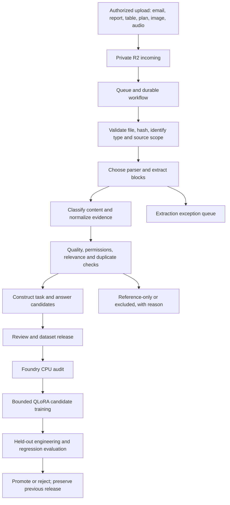

# R2 ingestion and continuous-training pipeline

Date: 2026-09-25. Status: architecture approved for implementation; offline implementation and independent acceptance are in progress. No ingestion infrastructure has been provisioned and no live source data or model has been changed. Draft PR publication may trigger Vercel preview builds; no preview data writes are part of this work.

## Intended result

Brad uploads an authorized collection of emails, reports, plans, spreadsheets, scans, images and recordings through one intake surface into a private Broadbridge R2 bucket. The system identifies what each file contains, selects a parser, extracts and normalizes it, preserves provenance, and proposes useful engineering training examples. Accepted examples enter an immutable dataset release. A bounded Foundry job trains a candidate adapter, evaluates it, and makes a reviewable model release available for promotion or rejection.

The bucket can hold heterogeneous source files. A model's training release contains only the relevant, permitted and technically suitable subset. An upload automatically starts ingestion; it does not automatically grant training rights or replace the served model.

This is an established MLOps pattern: CI/CD for pipeline code, continuous data processing, and continuous training (CT) for model candidates. [Google's MLOps architecture](https://docs.cloud.google.com/architecture/mlops-continuous-delivery-and-automation-pipelines-in-machine-learning) describes this separation. [SageMaker Pipelines](https://docs.aws.amazon.com/sagemaker/latest/dg/pipelines-overview.html) is an existing implementation of preprocessing, training, evaluation and conditional model registration; its [EventBridge integration](https://docs.aws.amazon.com/sagemaker/latest/dg/pipeline-eventbridge.html) demonstrates event-triggered pipeline runs. These are precedents, not a recommendation to migrate the Foundry to SageMaker.

## Recommended small initial stack

| Responsibility | Proposed component | Reason |
|---|---|---|
| Original and derived file storage | One private Broadbridge R2 bucket, with distinct prefixes | One upload destination; preserve originals and version every derived release |
| Upload notifications | Cloudflare Queue fed by R2 events | Reliable handoff and retry support |
| Durable orchestration | Small consumer Worker plus Cloudflare Workflows | Persist progress, wait for worker results/review, retry failed stages |
| Document conversion | Containerized Python worker using pinned Docling and format adapters | Local processing, structured output, reusable extraction rather than a custom OCR engine |
| Job metadata, permissions, review, lineage | Existing dedicated Broadbridge Neon project with new additive pipeline tables | Extend the current system of record; keep it separate from PermitHub |
| Review/status interface | Extend the existing Broadbridge capture application | Existing authenticated reviewers and case workflows |
| Dataset construction and training | Generic Foundry workers with the external oil-gas pack | Preserve engine/domain repository ownership |
| Training compute | Existing AWS GPU host, when explicitly enabled for a bounded run | Reuse the Qwen environment; no GPU operation was performed during this design |
| Model records | JSON manifests and Neon release records initially | Avoid another always-on service at pilot scale; MLflow can be added later |

Cloudflare documents [R2 upload events](https://developers.cloudflare.com/r2/buckets/event-notifications/) going to Queues, with prefix filters and Worker or external HTTP consumers. [Workflows](https://developers.cloudflare.com/workflows/) supports durable steps, retries and waiting for external events. Heavy OCR, transcription and training run in appropriate external workers; the workflow transports object references and job IDs, not whole documents or GPU computation.

An even smaller batch pilot could use a Python process to [pull Queue messages over HTTP](https://developers.cloudflare.com/queues/configuration/pull-consumers/) and persist stage state in Neon. It would need explicit worker availability and recovery handling. The managed Workflow option is the proposed unattended target.

## Data flow



File-type routing happens before full extraction. Semantic classification normally requires some extracted content; use a lightweight first pass, then refine the classification after the full parse. This avoids pretending that an arbitrary filename is sufficient to identify a technical document.

## Single-bucket layout

The implemented worker uses these immutable keys; live resources have not been created by this task:

```text
incoming/<project-id>/<upload-id>/original
registry/<project-id>/<canonical-key-hash>.json
recipes/<project-id>/<recipe-version>.json
originals/<project-id>/<job-id>/raw
originals/<project-id>/<job-id>/source.json
artifacts/<project-id>/<job-id>/<lease-token>/normalized.json
artifacts/<project-id>/<job-id>/<lease-token>/attachments/<attachment-id>
candidates/<pack-name>/<build-id>/examples.jsonl
datasets/<pack-name>/<release-id>/train.jsonl
datasets/<pack-name>/<release-id>/val.jsonl
datasets/<pack-name>/<release-id>/test.jsonl
datasets/<pack-name>/<release-id>/manifest.json
models/<pack-name>/<release-id>/adapter/...
evaluations/<pack-name>/<run-id>/...
```

Watch only `incoming/<project-id>/` for upload-triggered processing, excluding the reserved `attachments/` child path, so the pipeline's own outputs cannot retrigger ingestion recursively. Dataset/model prefixes above describe the later artifact archive; the current release controller first creates verified local directories. Preserve original filenames as metadata and use unique source/revision IDs in keys. Never overwrite an original revision. R2's [S3 compatibility matrix](https://developers.cloudflare.com/r2/api/s3/api/) does not support the S3 bucket-versioning APIs; implement explicit immutable object keys and manifests rather than assuming S3 version history.

A shared bucket does not merge project permissions. Enforce authorization at the application and worker layer; prefixes alone are not access control. The server authorizes exact upload/download keys. Credentials remain server-side and signed URLs do not enter logs or release manifests. This design uses R2 for the proposed raw/derived storage and requires the earlier S3-oriented plan/config to be aligned; no existing S3 or R2 bucket is assumed or migrated here.

## Processing stages and acceptance criteria

| Stage | Output | Automated checks | Human/exception handling |
|---|---|---|---|
| Receive | Upload receipt and immutable source revision | File bytes/size/type, source scope, checksum, safe archive handling, parse isolation | Unsupported, encrypted or damaged files get a visible reason |
| Classify | Type, domain, equipment/process, document role, language, confidence | MIME/content consistency; known source metadata; multi-label schema | Low-confidence or cross-domain cases queue for correction |
| Extract | Text, tables, images and page/time/block locations | Parser success, coverage, unreadable pages, attachments linked to parents | Review missing pages, equations, low OCR/ASR confidence and diagrams requiring specialist interpretation |
| Normalize | Common evidence representation | Units/basis, dates, table headers, provenance, source-version consistency | Resolve ambiguous measurement basis and contradictory sources; do not invent missing values |
| Admit evidence | Training-eligible, reference-only, evaluation-only, excluded or awaiting review | Explicit permission policy and pack relevance; exact/near duplicates; version/thread families | Uploader/rights owner supplies permissions; a classifier cannot grant them |
| Build examples | Draft task/input/answer rows | Answer support, deterministic calculation checks, output schema, hindsight leakage | Review new engineering answer patterns; accept or reject with reason |
| Release dataset | Immutable train/dev/test snapshot and manifest | Family isolation, all source rights, reference-answer separation, content hashes, revocation checks | Approve the dataset release; no fake expert signoff |
| Train | Candidate adapter, logs and run manifest | Local token/mask/length audit, pinned runtime/base, bounded steps/time, checkpoint health | No eligible release or budget means no training job |
| Evaluate | Comparable base/adapter scorecards and regressions | Same input/evidence/template/settings; units, tolerance, grounding, critical errors | Technical acceptance remains with the appointed reviewer |
| Promote | Versioned release pointer | Evaluation passed, approval recorded, build integrity and rollback target | Initial production promotion is explicit; failed candidates never replace the current model |

For an initial source type with known permissions and a well-tested extraction/validation recipe, more steps can run without individual review. New expert interpretations, uncertain extraction and operational model acceptance remain reviewable decisions. The goal is to automate routine processing and expose exceptions, rather than require manual re-entry of every record.

## Normalized data contract

Introduce a generic normalized-document contract in the Foundry; exact JSON Schema is implementation work. Required concepts are:

- `source_id`, source revision, project scope, original SHA-256 and original object key;
- uploader/owner and explicit permission record, separate from predicted document class;
- parser/model/recipe versions and extraction status;
- document labels such as discipline, equipment, process and document role;
- ordered blocks: text, table, equation, image reference or timed transcript segment;
- block IDs, original page/bounding box or recording timestamps, source text and quality flags;
- structured measurements retaining value, unit, absolute/gauge and mass/molar/wet/dry/standard-state basis;
- attachment, email-thread, document-version and case-family relationships;
- redaction/restriction records, review decisions and lineage to derived examples.

Keep the existing `broadbridge.case_record/1` contract unchanged. Emails and technical handbooks are source records, not automatically signed expert cases. Their examples can join case-derived examples at a curated release with source-specific provenance. The case importer must continue enforcing signed/training eligibility and family-wide strictest splits. Public-source candidates need their own documented admission path; do not forge case rows to fit the current importer.

The release builder must preserve existing assignments, translating case `dev` to Foundry `val` and `locked_test` to `test`. The current generic `prepare.py` can group families but randomizes splits; do not pass already assigned case rows through it as though it preserves their holdouts. Similarly, current deployment artifact verification does not enforce a model evaluation acceptance receipt. The new release controller must enforce that receipt before invoking promotion.

Example classification of a raw email thread: `document_role=troubleshooting_correspondence`, `practice=downstream`, `equipment=heat_exchanger`, `topics=[fouling, thermal_performance]`, with a separate `rights_status` and extraction confidence. A construction software task brief should be classified outside the oil-gas pack; uploading it does not teach useful petrochemical behavior by itself.

## Choosing extraction and curation components

[Docling](https://github.com/docling-project/docling) is the proposed parser to test first. Its project documents PDF/Office/email/image parsing, OCR, structured export, audio transcription and local execution. Code is MIT licensed; model artifacts have separate licences. Test format support in the pinned version rather than relying on an evolving README. Native CAD/BIM and specialist engineering topology need dedicated adapters or explicit unsupported status.

[NVIDIA NeMo Curator](https://github.com/NVIDIA-NeMo/Curator) provides established multimodal curation, filtering and deduplication components under Apache-2.0. It is a useful scale-up option, not required for the first small corpus. [MLflow](https://mlflow.org/docs/latest/ml/tracking/) can later centralize experiment records and model lifecycle workflows if JSON/Neon records become insufficient. None of these libraries automatically establishes correct engineering target answers.

## Agents and deterministic code

Use parsers and deterministic validation for file structure, hashes, dates, schema checks and calculations. Use narrowly scoped model-assisted tasks for semantic classification, example drafting and reference-supported quality assessment. Store classifier/generator prompts, model versions, outputs and confidence/flags so they can be reproduced and reviewed. The workflow manages retries and state; a conversational agent session is not the durable production scheduler.

Source text remains data. Embedded commands, requests to reveal credentials, or claims of approval inside a file cannot change the pipeline policy. Extraction workers cannot execute document macros or arbitrary uploaded code. For confidential data, preserve the existing local-model policy unless explicitly changed; model unavailability queues the relevant stage instead of silently sending material to an external service. Rules-based parsing and CPU work can run while the L4 is stopped.

## Multimodal input versus multimodal model training

Both paths should share the same original-file store:

1. **First release:** accept multiple file formats and convert text, tables, scanned text and transcripts into examples for the current text-only Qwen3-8B. Preserve original visuals and page/time links. This does not give Qwen native vision or audio perception.
2. **Later vision release:** preserve image/diagram plus question/answer pairs; select a compatible vision-language base, processor, training collator and serving path; test tag recognition, diagram connections and source-grounding. A diagram caption or OCR dump is not equivalent to validated P&ID topology. Audio/video transcripts similarly do not train native acoustic understanding.

The existing Foundry encoder supports text messages and rejects native tool-call/multimodal records. R2 storage format does not remove that model/engine constraint. The first public math rehearsal and DOE conversion work remain useful inputs while this reusable pipeline is designed.

## CI, dataset builds, training and deployment

- **CI on code changes:** test parser adapters on checked fixtures, normalized schemas, family split enforcement, secret-safe logs, retries and release contracts. Build pinned CPU/GPU containers or environments. Use synthetic/public CI fixtures; customer bytes stay outside source control and general CI logs.
- **Data pipeline on upload:** process and classify the object; produce traceable evidence and candidates. Always report where a file is in the workflow and why it stopped.
- **Dataset build on accepted batch:** freeze a manifest containing source versions and example IDs; hash train/dev/test files; run the CPU audit. Excluded/reference-only material does not enter training.
- **CT on released dataset:** run a bounded candidate experiment when an approved batch and compute budget exist. Initially trigger explicitly; a schedule or batch threshold can automate this once measured costs and quality are known. Do not assume every upload should retrain the model.
- **CD of a candidate model:** evaluate, record approval, build the serving artifact, then move the release pointer. Preserve the previous artifact and configuration for rollback.

Prefer reproducible experiments from a pinned base and a documented cumulative/replay mixture. Repeatedly fine-tuning only the newest files risks forgetting earlier behavior. A retry resumes the same run or creates a clearly new attempt; it must not silently start an unbounded second GPU job.

## Reliability and lineage

Cloudflare Queues has [at-least-once delivery](https://developers.cloudflare.com/queues/reference/delivery-guarantees/). Use unique jobs keyed by project/source revision/content hash/pipeline recipe, leases, retry counters and an exception queue. Do not use message arrival time as the sole identity. A changed parser recipe can intentionally rebuild derivatives without overwriting originals.

R2 and Neon do not share one atomic transaction. Write objects to unique keys, verify their hashes, then commit the metadata/manifest that makes a stage visible. Record incomplete attempts and reconcile orphan objects or pending rows after crashes. Never display a dataset as published before all referenced artifacts are durable and the manifest is committed.

Maintain the graph `source revision -> evidence block -> example -> dataset release -> training run -> model release`. Revoking a source blocks future dataset builds and identifies affected releases. Deleting an R2 object does not erase information from an already-trained adapter; replacing an affected model may require retraining without those examples.

For evaluation, hold out whole incident/document families and generated problem templates. Do not repeatedly tune against the locked acceptance set. Retain public-data and expert-case benchmark provenance so familiarity with public reports cannot masquerade as validation on new expert knowledge.

## Implementation slices

Repository ownership stays as decided: reusable storage adapters, parsers, workflow/job interfaces, normalized schemas, training orchestration and tests belong in `slm-foundry`. Oil-gas classification taxonomy, rights policy, engineering example recipes, reviewer rubrics, manifests and domain configuration belong in `Broadbridge4096/packs/oil-gas/`, consumed through an external `--pack` path. The Broadbridge review UI and its additive database migrations remain in Broadbridge4096. Neither repo receives PermitHub credentials or customer records from another project.

The existing database's `runs` and `scorecards` are case-specific. Introduce separate ingestion jobs, dataset releases and model-training run records rather than forcing a corpus-wide training job into a fake case. Existing evidence already supports a source without a case link.

| Slice | Concrete deliverable | Acceptance evidence |
|---|---|---|
| 1. Intake and job tracking | R2 object receipts, Queue adapter, durable job states, file list/status UI | Same event delivered twice produces one logical job; pipeline outputs never loop back into intake; retries preserve source bytes |
| 2. Extraction and normalization | Pinned Docling worker, selected format fixtures, normalized schema, source preview | Text PDF, scanned PDF, DOCX, email with attachment, spreadsheet and image each retain provenance; unsupported/partial parses are visible |
| 3. Engineering dataset builds | Classification rules, rights policy, reviewed example recipes, family-aware release builder | Reference-only/revoked records excluded; no hindsight/reference leakage; deterministic hashes and family-isolated splits |
| 4. Foundry job integration | Released dataset download, CPU audit, bounded QLoRA run interface, run manifests | Rehearsal adapter saved/reloaded; interrupted attempt handled; base/adapter evaluation uses identical settings |
| 5. Candidate release and rollback | Scorecards, acceptance record, immutable serving artifacts, release pointer | Failed candidate cannot promote; previous model can be restored with its config and provenance |
| 6. Native multimodal extension | Vision-compatible pack/engine adapters and diagram/image benchmark | Measured visual-task improvement beyond OCR-only input; no assumption that text Qwen or its GGUF deployment supports the new model |

Slices 1-3 can be developed and tested without starting the training host. Before live provision, resolve the Broadbridge R2 account/bucket, upload access and volume, CPU worker deployment target, allowed local classifier/extraction models, and run budget. These are implementation configuration decisions; no connection to a PermitHub bucket, database or pipeline is inferred.

## Current work versus proposed work

This turn performs repository audit, public-source research and design only. Two read-only agents checked reusable components and established implementations. The public-data acquisition and CPU audit from 2026-09-24 remain intact. Existing source/evidence/case tools and Foundry train/evaluate/deploy components can be reused, but there is currently no R2-driven ingestion orchestration or automatic multimodal-to-SFT system in these repositories. No cloud resources, migrations, deployments, model runs or PRs were created for this design.
