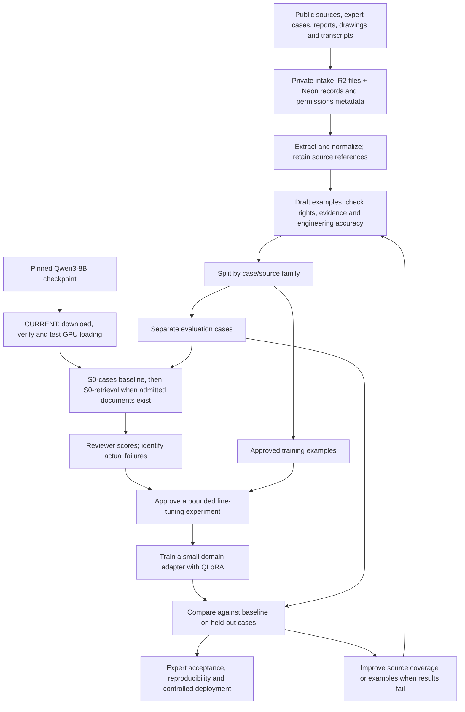

# How Broadbridge's engineering SLM is built

There are two inputs: a pretrained model and reviewed engineering examples.
Qwen3-8B supplies the general language model. Broadbridge's examples teach it
selected engineering tasks; separate cases measure whether it improves.

## The current approved step

Download the pinned **16.40 GB Qwen3-8B checkpoint**, verify all 15 files, then
check that the model loads in NF4 (4-bit) on the existing AWS A10G. The existing
runtime has passed its package and small GPU checks. Loading tests model
compatibility and records memory use; it does not establish engineering accuracy
or memory required for training. This session performs **no inference or training**.

Latest outcome: acquisition did not begin. Two controller preparation errors
were fixed, then AWS rejected the corrected start for insufficient capacity.
All GPU hosts are stopped. The model checkpoint and load check remain pending;
the engineering data has not been used in a fine-tuning run.

The checkpoint contains numerical model weights, configuration and tokenizer
files. It is not a collection of Bill's documents. The approved scope and result
are maintained in [the model-load runbook](QWEN_MODEL_LOAD_SESSION.md).

## Overall flow

Evaluation answers and locked-test families never feed the training set. A
change informed by a development evaluation needs genuinely unseen cases for
the final assessment; repeated tuning on locked tests invalidates that holdout.
Retrieval must first improve on S0-cases under the approved plan. Fine-tuning
must then demonstrate a useful improvement without new critical errors.

## What each stage creates

| Stage | Output | Purpose |
| --- | --- | --- |
| Intake | Original files, canonical case records, ownership/use records | Preserve what was supplied and what uses are permitted |
| Extraction | Text, tables, units and source-linked evidence blocks | Make varied files usable without losing their provenance |
| Curation | Reviewed questions, supported answers, tolerances, abstention examples and hard-fail criteria | Teach the task and define what a good answer requires |
| Dataset release | Immutable messages JSONL, manifests, hashes and family-separated splits | Make each experiment reproducible and avoid evaluation leakage |
| Model preparation | Hash-verified checkpoint plus GPU-load receipt | Establish that the selected base can be loaded in the pinned environment |
| Fine-tuning | A small QLoRA adapter and recoverable experiment checkpoints | Adjust task behavior while keeping the base model identifiable |
| Evaluation | Reviewer scorecards and baseline/adapter comparison | Establish measured benefit and expose dangerous or unsupported answers |
| Deployment | An accepted, versioned serving artifact and rollback record | Deliver a reproducible model through controlled access |

Documents can also support retrieval: the system fetches relevant evidence at
answer time. Retrieval keeps source material inspectable; fine-tuning changes
model behavior. Fine-tuning is not a document database or a guarantee that all
facts in an archive will be recalled correctly.

Bill or another appointed expert sets priorities, contributes cases, validates
reference answers and reviews outcomes. Synthetic agents may draft examples;
their output remains pending until independently accepted. Review gates prevent
an automated feedback loop from teaching the model its own mistakes.

Qwen3-8B is the current text model. Drawings and audio require separate extraction
and review paths. Diagram-derived training remains blocked by its connectivity,
provenance and evaluation gates; this flow does not imply those gates are closed.
The current queue is [SLM_WORK_QUEUE.md](SLM_WORK_QUEUE.md).
