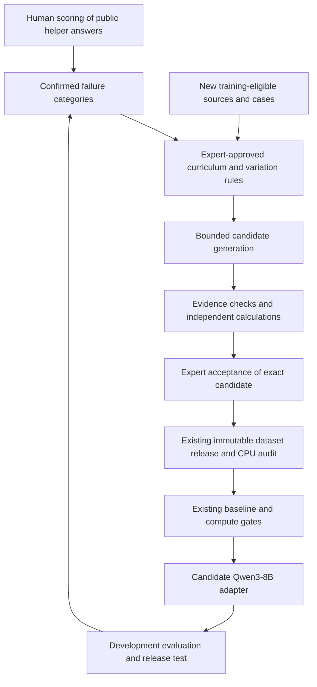

# Expert-guided synthetic training data

The authenticated [public-document scoring page](PUBLIC_REVIEW_URL.md) links fixed source/question/answer review into the capture workflow, with separate reviewer records and CSV export.

SD-02 is implemented as an offline pending packet plus a two-record fabricated
rehearsal. All six negative cases reject and unreviewed candidates cannot enter
a release. It makes no model calls and does not close the human SD-01 gate.
Use the reviewer page to identify real failure categories before SD-03 live work.

Status: workflow added on 26 September 2026 at Brad's request. This subproject
extends the main SLM workflow. Generation, expert acceptance and training have
not been performed by adding this document. The first deliverable is a reviewed
curriculum and an offline rehearsal, followed by a bounded candidate pilot.

[Implementation tasks](superpowers/plans/2026-09-26-synthetic-expert-data.md) ·
[Expert worksheet](templates/SYNTHETIC_EXPERT_REVIEW.md) ·
[Current public evaluation](PUBLIC_DOCUMENT_EVALUATION.md) ·
[Existing admission and release procedure](INGESTION_PIPELINE_RUNBOOK.md)

## Position in the main workflow

Only development failure categories return to the curriculum. Locked evaluation
content, reference answers and answer-specific feedback do not return to the
generator. Release testing remains independent of that loop.

The next main-project action is human scoring of the existing public-document
packet: 30 returned answers and 30 failure/not-run slots, with all 60 human rows
still blank at this revision. Its assistant pre-review identifies possible
failure categories; it does not establish confirmed errors or expert acceptance.
Bill reviews the original packets, then adjudicates the flagged concerns. Brad
may screen first. The original answers, references and scores are preserved.

This helper evaluation is not S0-cases, S0-retrieval or a Qwen3-8B benchmark.
Gate 0 still requires rights/storage, the named reviewer and at least 30
case-derived questions across the five types from signed cases. Run S0-cases
first; build S0-retrieval after the first scored briefs and about 20 admitted
documents. Its required improvement over S0-cases, training authorization and
host prerequisites remain in force. Synthetic examples do not close those gates.

## Decision owners

| Decision | Accountable owner | Contributions and limits |
| --- | --- | --- |
| Scope, source rights, external processing, compute budget and final release | Brad | Record separate decisions; an expert's technical acceptance cannot grant rights |
| Curriculum, technical rubric and candidate acceptance within competence | Bill Hurt, appointed reviewer for the Technical Director function | May require a separately appointed specialist for topics outside his scope |
| Specialist seed cases, diagnostic rules and challenges | Bill; Norman Lieberman only if engaged | Norm remains a candidate contributor, not an appointed reviewer or an agreed participant |
| Implementation, reproducibility and mechanical checks | Head of Product & AI function, currently Brad with implementation support | Cannot manufacture expert signatures or substitute passing code tests for technical acceptance |
| Independent assessment of authored material | A separately named qualified reviewer | Does not certify their own authored work; author and accepting reviewer are recorded separately |

Until positions are filled, Brad holds the target organization roles. Bill is
the appointed technical reviewer; this subproject does not create new employees
or appointments. Where Bill authors an answer or a substantive correction, it
needs a different qualified accepting reviewer. If none is appointed, retain it
as pending rather than representing self-review as independent acceptance.

## Agent roles and evidence

Run roles sequentially in one bounded job initially. Separate prompts are not
independent engineering authorities. The challenger may use a separately
evaluated model; neither a different provider nor model consensus proves truth.

| Role | Input | Output | Prohibited authority |
| --- | --- | --- | --- |
| Author/solver | Approved training evidence, recipe and allowed givens | Candidate question, answer, assumptions, exact source/block references | Cannot choose rights, split, actor or approval |
| Challenger | Candidate, allowed evidence and expert rubric | Specific objections with evidence; missing-data and basis checks | Cannot change the source record or sign off |
| Mechanical verifier | Frozen candidate and source bytes; reviewed calculation artifact where applicable | Per-check results with versions, hashes and reasons | Cannot convert arithmetic success into whole-answer acceptance |
| Expert reviewer | Candidate, objections, checks and source context | Accept, revise, reject or escalate, bound to the exact candidate | Cannot approve their own authored material as independent review |

Proposed check statuses are `pass`, `fail`, `not_applicable` and
`needs_review`. Store checks separately for source support, arithmetic, units and
basis, physical assumptions, completeness, and unsupported-action handling.
An empty or inapplicable check is never a pass. Human technical acceptance and
source permission remain the existing separate decisions.

Each run records source revision/hash and family, recipe/prompt/rubric hashes,
model/provider/settings, generation receipts, candidate hash, check evidence,
author, reviewer and timestamps. Store this provenance alongside the unchanged
`foundry.training_example/1` candidate; do not add unknown fields to that strict
schema. New provenance checks and enforcement are planned work, not existing
runtime capabilities.

## First pilot

The initial target is **100 candidate examples, 20 per task type**, subject to
expert acceptance of the curriculum. This is an experiment size, not a minimum
training-data requirement or an accepted-example quota. Do not replace rejected
examples automatically to manufacture a 100% acceptance rate.

| Type | Intended learning | Verification emphasis |
| --- | --- | --- |
| brief | Accurate, concise account of available facts | Material claims supported; uncertainty preserved |
| missing_data | Ask for discriminating measurements and context | Expert-required inputs, units and basis |
| calculation | Apply a reviewed method to explicitly stated givens | Independent result, dimensions, applicability and tolerance |
| grounded_explanation | Separate observation, inference and competing explanations | Source support and scope of the inference |
| abstention | Withhold an unsupported conclusion and identify needed evidence | No invented diagnosis or unauthorized operating instruction |

Use new approved training families, with a proposed maximum of 10 candidates
per family. If fewer than 10 eligible families exist, reduce the pilot and report
the coverage gap. Paraphrases are not independent cases. Pilot review covers every
candidate. Acceptance rate, reviewer time and confirmed errors determine whether
later template-based sampling is justified.

Start with source-grounded examples and missing-information variants. A new
numerical result needs the separately reviewed calculation path. The existing
Foundry `src/ingestion/assist.py` rejects a generated number absent from its
evidence (`new_numerical_claim_requires_separate_calculation_review`); do not
remove or weaken that guard. Calculation records must distinguish synthetic
givens and computed outputs from facts quoted from a source. A reviewed
calculation artifact must enter the normal source/provenance process before
its derived candidate can use the existing release bridge.

Simulator sweeps, preference training/DPO and reinforcement learning with
verifiable rewards follow successful initial supervised fine-tuning. They are
future packages, not dependencies of this first pilot. Native multimodal training
also remains separate; Qwen3-8B's current training path consumes text.

## Admission, confidentiality and holdouts

- Existing public-v1 source families remain `testing_only/dev`. No answer,
  paraphrase or derivative of those families becomes training data. High-level
  failure categories may inform new independent training families; record that
  this calibration set has influenced development and is not an unseen test.
- Assign and persist family splits before generation. Apply the strictest split
  to all descendants, including excluded and historical records. Changing a
  family ID or copying a source into another pack cannot evade this rule.
- Case inputs remain `identity.unit_service` plus `decision_time`; hindsight
  and reference answers are never student prompt content. Existing signed-case
  eligibility and `broadbridge.case_record/1` stay unchanged.
- Public helper processing requires approved rights and exact document/policy
  authorization. Select open-weight teachers using the existing cost/quality
  evaluation; the current incomplete comparison has not selected a winner.
- Confidential expert records remain in the dedicated Broadbridge environment.
  No cloud fallback, no relabeling as public, and no sending Bill/Norm records to
  OpenRouter through the public companion pack. With local inference unavailable,
  retain work for later; this plan does not start EC2.
- Generated records cannot become signed human cases or receive a fictional
  Bill/Norm sign-off. Generic source candidates use their own rights and review.
- Every accepted candidate still passes registration, current-rights checks,
  hash-bound technical review, explicit release approval and the CPU token audit.
  Any edit after review invalidates the old acceptance.
- Repository policy is public code, plans and fabricated fixtures only. Real
  expert records, completed worksheets and private manifests remain in approved
  private storage. Never commit secrets or credentials.

## Bounded improvement loop

Begin with one baseline and one candidate adapter after the existing gates pass.
For each later iteration, freeze its source set, recipe, verifier, prompt and
dataset versions before generating or training. Record all rejected attempts,
provider failures and costs; no invisible retries or automatic model promotion.

Use development results for curriculum changes. Reserve a fresh locked family
set for release assessment and control repeated exposure to its scores. If an
item is exposed for diagnosis, retire its unseen status and replace the affected
family prospectively. Never rewrite the prior test or report it as still unseen.

Compare adapters under identical prompt/template/think settings and evaluation
inputs. When enough expert data exists, compare an expert-only adapter with an
expert-plus-synthetic adapter at matched training settings and a stated token
budget. Include the approved retrieval baseline and unrelated competency checks.
Without that comparison, describe improvement over baseline without attributing
the gain specifically to synthetic data.

Report per-type 0-2 quality, critical errors, missing-data/abstention behavior,
source support, family coverage, cost per accepted example, reviewer minutes per
accepted example, and measured latency. Model promotion requires the existing
acceptance rule and no new critical errors on the evaluated set; it does not
prove that no unseen critical errors exist. Proposed public-helper thresholds
remain subject to Brad/Bill's decision, not silently adopted here.

## Status and next action

Workflow and blank expert worksheet: prepared. Runtime orchestration, verifier
extensions, expert-approved recipes, the 100-candidate pilot and synthetic-data
training comparison: not implemented or run by this change.

The next human action remains completing the original public-review score rows
and confirming the helper-selection criteria. The next independent engineering
package is the mocked offline harness in the linked plan. Neither step requires
a model call, a database write, a new deployment or EC2.

## Research basis

Synthetic instruction generation has precedent in
[Self-Instruct](https://arxiv.org/abs/2212.10560). Tool-supported correction is
studied in [CRITIC](https://proceedings.iclr.cc/paper_files/paper/2024/hash/fef126561bbf9d4467dbb8d27334b8fe-Abstract-Conference.html).
[Self-Rewarding Language Models](https://arxiv.org/abs/2401.10020) studies iterative
model-generated feedback. These motivate experiments; they do not certify
engineering answers. [DWSIM automation](https://dwsim.org/wiki/index.php?title=Automation)
and [TRL custom rewards](https://huggingface.co/docs/trl/grpo_trainer) are future
implementation options, not installed or validated components of this pilot.
