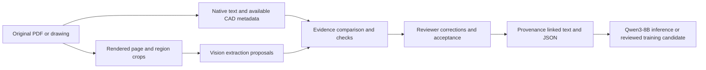

# Vision companion for the Qwen3-8B pipeline

27 September 2026. FQ-05 local pilot implemented with separate pinned Docker
models. See [execution results](LOCAL_VISION_RESULTS.md), the
[runbook](LOCAL_VISION_RUNBOOK.md) and [visual training input guide](VISUAL_TRAINING_INPUTS.md).
The protocol below remains the design basis; its software outputs are not
engineering acceptance or permission to train.

Use a separate vision-language model at ingestion to produce reviewable diagram
evidence. Retain Qwen3-8B as the text engineering model and fine-tuning target.
This makes the ingestion system multimodal; it does not give the current text
model native image input. Native vision fine-tuning remains a later project.

## Candidates tested

| Candidate | Proposed job | Evidence and limit |
| --- | --- | --- |
| Qwen/Qwen3-VL-4B-Instruct | Read labels and propose visually supported relationships in diagrams/charts | Official card describes OCR, spatial grounding and multimodal reasoning. Suitability for engineering connectivity is unmeasured. |
| ibm-granite/granite-docling-258M | Recover document structure, equations, tables and page locations | Official card targets efficient document conversion and equation recognition, with Docling integration. It is not proof of P&ID topology understanding. |

Both official cards declare Apache-2.0. Pin model revision, runtime, processor,
quantization and image settings before any installation/run; retain the license.
Model licensing does not settle input-document permissions.

Sources checked on 27 September:
[Qwen card](https://huggingface.co/Qwen/Qwen3-VL-4B-Instruct),
[Granite card](https://huggingface.co/ibm-granite/granite-docling-258M),
[Docling picture enrichment](https://docling-project.github.io/docling/usage/enrichments/).
Published capability is a reason to test, not a measured engineering result.

## Data path

For each proposed observation retain source revision/hash, PDF page, crop bounds
and crop hash, original label, proposed normalized label, object type, relation
endpoints/direction, uncertainty and unresolved content. Link every relation to
image regions; never infer a connection solely from nearby labels or crossing
lines. Distinguish observed marks from engineering interpretation. Prefer
structured CAD connectivity when supplied and authorized, and report conflicts
instead of allowing a model to silently overwrite it.

Validate JSON shape, identifiers, crop bounds, units, pressure basis and references.
Arithmetic checks apply only after the measurement and its meaning are accepted.
Schema validity and agreement between models cannot certify a diagram.
Keep rejected/uncertain interpretations and corrections. No source instruction or
model output may change rights, reviewer identity, split or admission status.

## Bounded first pilot

1. Reuse the FQ-02 originals and page renders. Include PDF 35's pressure diagram,
   PDF 36's subscripts/rho, and PDF 37's superscript and conversion list. Those
   three pages exercise known failures; they are not an unseen benchmark.
2. Add explicitly fabricated readable and deliberately ambiguous diagrams with
   recorded expected labels/relations: crossing versus connected lines, an
   unreadable tag, missing arrow direction and conflicting pressure bases.
   Preserve their provenance and do not describe them as real plant drawings.
3. Freeze references before model outputs. Compare native extraction alone,
   Granite document conversion, and Qwen-VL diagram proposals on the same images.
   Run serially on local Docker with bounded image resolution/context/output,
   timeout and peak-memory receipt. Do not run concurrent heavy voice jobs.
4. Record exact label/unit accuracy, relation precision/recall, formula fidelity,
   abstention on unreadable regions, omitted content, invented connections,
   latency and human correction time. Timeouts and invalid results remain in the
   denominator. Self-reported confidence is not a calibrated correctness score.
5. Require separate technical acceptance before using real engineering outputs.
   Record reviewers' proposed acceptance thresholds; unresolved invented
   connections, basis swaps or altered operators must prevent admission of the
   affected candidate. Retain an independent family for later evaluation.

Start with Granite's smaller document-conversion model; compare Qwen-VL where
diagram relationships remain unresolved. This is a resource-based test order,
not a claim that Granite is the better model. A 4 GB desktop GPU is not a promise
that a 4B VLM fits: quantized weights, vision encoder, image tokens and runtime
overhead must be measured. CPU operation may be slow. No EC2, Railway or paid
cloud fallback is part of this proposal.

Generic local adapter and evidence validation belong in slm-foundry; the DOE
selection, engineering rubric, family assignments and review decisions belong
in Broadbridge4096. Reuse the pinned Foundry Docling adapter after compatibility
verification; do not silently upgrade its runtime to match current online docs.

## Training use

Accepted observations can support text/JSON question-answer candidates and
retrieval evidence for Qwen3-8B. The generated descriptions are derived records,
not original quotations. Preserve ancestry and whole-family holdouts. Rights,
engineering review, dataset release and compute authorization still apply.
The first pilot measures extraction; it must not be reported as improved model
reasoning or successful fine-tuning.
