# Expert discovery and feedback capture — proposed design

Date: 27 September 2026
Status: DRAFT FOR BRAD'S REVIEW. This is a design, not a deployed questionnaire.
Working name: Broadbridge Engineering Discovery.
Questionnaire: [v1 draft](../../questionnaires/ENGINEERING_DISCOVERY_V1_DRAFT.md).

## Purpose and success

Extend Broadbridge's capture application with a versioned questionnaire for individual interviews, focus groups and repeat feedback. Capture known needs, participant-originated ideas and rare engineering problems. Accept typed responses, supplied transcripts and, in a later increment, directly recorded/uploaded audio.

Success means an invited participant can contribute and correct their own answers; a facilitator can trace every proposed issue to its original response or transcript segment; rare or disputed observations survive aggregation; selected tasks become explicit curriculum/evaluation decisions. Submitted opinions, consensus and transcription accuracy are not proof of engineering correctness.

The user requested a database-connected URL, open suggestions, verbal capture and a feedback loop. Working assumptions pending confirmation: invitation-only participation, participants see their own responses, Brad administers discovery, and English is the first transcription language. No invitations, live processing or production changes are made by this design.

## Approaches considered

1. **Extend Broadbridge Capture — recommended.** Reuse the deployed origin, Auth.js identity, dedicated Neon project, SQL migration ownership and private R2 storage. Add discovery-specific authorization and versioned records.
2. A separate survey service plus import would provide questionnaires quickly but introduce another identity, permission and transcript-linking boundary.
3. A conversational interviewer alone would support free discussion, but make comparison, omissions and provenance harder to control. It can later assist the structured workflow; it should not silently alter the questionnaire or participants' answers.

## Proposed routes and participant experience

Proposed entry route: `https://broadbridge-capture.vercel.app/discovery`.
Study-specific route: `/discovery/<study-id>`.
These routes are planned and do not exist yet. Sharing the page URL does not grant access. Authentication emails remain separate from the persistent page link.

Start with a short independent response before showing suggested topics or group results. A participant may save and return, add any number of task/issue cards within documented record limits, use "unknown/not applicable", and choose an optional rare-case interview. The suggested list never restricts what can be submitted.

Steps:
1. Identity/experience, participation choices and brief instructions.
2. Open discovery, before suggested categories are shown.
3. Rank known and newly proposed tasks.
4. Optional rare/difficult-case narrative.
5. Evidence, practical value, limits and follow-up.
6. Review what was captured and submit.

Every topic section includes "Add a task or issue we have missed". A separate "I disagree / important exception" action preserves dissent instead of averaging it away. Free text remains intact when tags are added. An unknown is not converted to a zero score.

The short initial path asks for A01-A03 and B01-B03; later sections may be skipped, saved for follow-up or completed for one priority only. The interface does not require a 31-question sitting.

A facilitator can create a focus-group session, record the participants' stated views with attribution, and invite corrections. Each participant also has their own independent response. The group summary is a separate record; it does not overwrite individual answers or imply unanimity. Participants need not have an account solely to be recorded in a facilitator-led interview, but must be distinguished from authenticated submitters and must have recorded participation choices.

## Questionnaire and feedback model

The linked draft supplies stable question IDs and the exact proposed copy. Published questionnaire versions are immutable. Changes create a new version and responses retain the version actually presented.

Discovery has two passes:
- Initial open account of the participant's work, problems and exceptions.
- Prompted comparison with the listed product directions and explicit priority choices.

Record whether an issue was volunteered, selected from a list, raised during discussion or proposed by an assistant. Repeat mentions by one person and repeated interviews are not counted as independent respondents.

A task card records the job, intended user, trigger, required inputs, output, acceptance evidence, available source material, uncertainty, frequency, consequence and reviewer needs. The system links it to relevant existing cases without copying private case content into participant-visible records.

Rare-issue cards preserve the operating context, misleading indicators, missing observations, exception to the usual rule, turning point, impact and limits of the lesson. They distinguish observed events, reconstructed recollections and hypothetical concerns. A resolved historical case also separates decision-time information from hindsight.

## Access boundary

Current code at 9db21f9 uses an email allowlist; `loadCapture` returns the shared case list to admitted users. Merely adding focus-group emails to the current allowlist would expose existing cases. Access controls must be implemented and tested before inviting new participants.

Use explicit product permissions:
- Discovery participant: own responses and their own media/transcript derivatives in assigned studies.
- Discovery facilitator: only studies explicitly assigned, their participant records and approved session media.
- Discovery administrator: study/version/enrollment management, issue triage and aggregate views.
- Existing engineering reviewer/capture access: separate grant; discovery enrollment does not confer it.

Brad initially administers discovery. Bill retains his existing case/reviewer access; this does not automatically appoint him administrator of every future focus group. Identity comes from the authenticated session. A facilitator's entry stores both actor and attributed contributor, without impersonating the contributor.

Enforce access in every page, server action, export, media download and background job. A guessed UUID or copied URL is not authorization. Recheck enrollment/role state per action. Keep confidential case records outside discovery aggregates. No participant automatically receives another participant's audio or answers. Whole-group recordings are restricted to authorized facilitators; participant review uses their attributed excerpts. A signed URL for the full group recording must not be issued merely because one segment belongs to that participant. Separately authorized sharing or participant-specific media needs its own access check.

## Verbal capture

### First usable increment: transcript-assisted interviews

Accept pasted text and uploaded UTF-8 TXT, VTT and SRT transcripts. Preserve the original file/hash, speaker labels and timestamps when supplied. Plain TXT without timestamps remains untimed; never fabricate positions.

A participant or facilitator selects a question and links a transcript passage to it. Any automated proposal is a separate draft, with exact segment/span references. The source transcript, extracted proposal and confirmed answer are distinct records. Source text is data, never an instruction to change permissions or approve content.

Unmapped segments go into an explicit review queue, not the trash. This is where unexpected topics and long-tail problems often appear. Allow splitting a passage across several questions and linking one issue to several supporting passages.

### Recording and audio increment

Add "Record answer" per question and whole-session recording/upload. The browser requests microphone access only after the user chooses Record. Show elapsed time, recording state and pause/stop controls. Support a documented, tested set of formats rather than claiming universal browser/audio support.

Record the participant's choices about recording, transcription/analysis and later recontact separately from training permission. For group recordings, record participant acknowledgments; a facilitator cannot silently grant another person's permission. Unknown speakers remain unknown until corrected.

Send audio directly to private R2 using short-lived upload authorization bound to the session, actor, object key and size/type constraints. Confirm stored bytes and checksum before marking the upload complete. No audio bodies in Neon or ordinary Vercel server-action payloads. Use authenticated, short-lived playback access.

Queue transcription on the existing CPU-worker architecture; never make an upload start Qwen fine-tuning. Prefer the existing local-only Foundry adapter for private expert material after it passes an actual speech test. If local transcription is unavailable, show a queued/unavailable state and permit a supplied transcript. No silent cloud fallback.

Foundry already has a local Docling audio path and transcript block/time-locator contract, but installed speech models, real speech accuracy and multi-speaker attribution have not been demonstrated by this review. Those are explicit acceptance tasks, not completed integrations. Speaker diarization may propose anonymous speaker labels; named attribution requires confirmation.

Flag doubtful equipment tags, numbers, decimal points, units, negations and speaker boundaries for correction. A participant confirms their interpretation where practical; facilitator-reviewed and participant-confirmed records remain distinguishable. Re-transcription or corrections create new versions and invalidate dependent proposals until reviewed.

## Data ownership and proposed records

All domain tables stay in the existing `broadbridge` schema in Broadbridge's dedicated Neon project. Reuse the repository SQL migration mechanism; no ORM-managed parallel schema. Original audio/transcripts use the approved private R2 environment. Development fixtures use dev resources only.

Proposed entities (names finalized with the implementation schema):
- `discovery_questionnaires`: version, immutable published question definitions, response schema and content hash.
- `discovery_studies` and `discovery_enrollments`: purpose, access scope, study round and participant/facilitator roles.
- `discovery_sessions`: individual/focus-group type, linked round, facilitator, attributed participants and participation choices.
- `discovery_response_revisions`: respondent, authenticated actor, questionnaire version, mode, answer JSON, previous revision and timestamps. Optimistic concurrency prevents silent overwrites.
- `discovery_media`: private object reference, byte hash, MIME/size, session/response binding, permitted processing and lifecycle state.
- `discovery_transcripts`: original/media binding, engine/version/settings or supplied-transcript origin, segment IDs, timings/speakers where available and revision history.
- `discovery_answer_proposals`: proposed answers/tags with transcript-span evidence and review disposition.
- `discovery_issues` and supporting links: task/long-tail/dissent/question types, supporting responses, original wording, confidence and triage decision.
- `discovery_decisions` and audit events: scoped decision, accountable actor, evidence snapshot, follow-up and optional links to canonical case/recipe/evaluation records.

Publish JSON Schema draft 2020-12 contracts in the domain pack, and derive runtime validation consistently with the existing app. Keep records bounded; large sessions are segmented rather than forcing them into the current 256 KB case limit. Use parameterized SQL, natural-key idempotency and server-derived actor identities. Do not change `broadbridge.case_record/1`, `broadbridge.workflow/1` or `foundry.training_example/1`.

Role grants, enrollment changes, submission/correction, transcript acceptance, issue decisions and exports are audited without dumping private text or access tokens into logs. Permission withdrawal blocks future processing/exports and descendant admission; already released data requires an explicit recorded impact review. Retention/deletion procedures must include raw media, derivatives and backups before real recordings are admitted; versioning does not require indefinite personal-data retention.

## Feedback and knowledge-base flow

```mermaid
flowchart LR
    A[Typed answer or permitted recording/transcript] --> B[Source-linked response and proposed issues]
    B --> C[Participant/facilitator correction]
    C --> D[Expert triage and priority decision]
    D --> E[Task specification or new case nomination]
    E --> F[Separate rights, technical review and family split]
    F --> G[Training candidate or evaluation item]
    G --> H[Measured model/application result]
    H --> I[Versioned follow-up round]
    I --> A
```

A searchable discovery register can initially use database filters and text search; a vector index is not required. Display both original evidence and interpretations. Do not summarize a concern as an established diagnosis.

Three distinct uses:
1. Product/market discovery: which tasks and outputs matter?
2. Knowledge acquisition: which cases, sources and expert lessons are worth developing?
3. Evaluation design: what constitutes failure, uncertainty and an acceptable result?

Discovery does not default to training consent. Its records remain reference for project discovery until a separate permission decision supports another use. Promotion produces a new draft in the existing case/source workflow; it never manufactures a signed case or expert acceptance.

Maintain existing whole-family holdouts. Locked-test content and answer-specific feedback must not return to generation; use development findings for curriculum changes. A feedback study that exposes an evaluation family changes how that family may be described as unseen.

## Aggregation that protects rare problems

Show frequency, consequence, effort, evidence availability and disagreement separately. Do not collapse them into one popularity score. Provide three views:
- Repeated jobs and friction.
- Rare or high-consequence exceptions, even one report.
- Unresolved/conflicting observations and newly proposed topics.

Each theme shows unique respondent/session counts, question version, supporting quotations/locators and correction history. Clustering is a suggestion; merging/splitting themes preserves original contributions. Small focus groups yield hypotheses, not statistically representative prevalence estimates.

Brad records scope/business decisions; a named qualified reviewer accepts engineering methods or conclusions. Bill can recommend a different specialist, including Norm if he agrees to participate. A model cannot fill either role.

## Delivery sequence and acceptance

This is proposed sequencing, not an approved implementation plan.

1. **Questionnaire and access foundation.** Versioned definitions, own-response access, facilitator attribution, autosave/conflict handling, new-topic cards, submission/export and PostgreSQL tests. Rehearse cross-user denial across all old and new routes before real invitations.
2. **Transcript-assisted discovery.** Upload/link original text, passage mapping, unmapped queue, source-linked proposals, correction history and triage dashboard. Synthetic interview fixture includes a novel issue and dissent.
3. **Audio capture and ingestion.** Direct private upload, bounded jobs, tested local speech route, timestamp playback, terminology correction, cancellation/retry and explicit unavailable states.
4. **Feedback rounds and reviewed handoff.** Aggregation, versioned follow-ups, task decisions and draft case/recipe nominations. Preserve permissions and holdouts end to end.

For each increment: local tests, dev database rehearsal, isolated Preview, user review and separately authorized production promotion. Draft PRs only; one implementation lane. Base the app changes on current released main and deliberately integrate required ingestion dependencies. Do not deploy an old ingestion branch snapshot over current capture/auth changes.

Required checks include:
- Participant A cannot access B, shared cases, reviewer scores or another study's media by page/action/export/object ID.
- A second interview and questionnaire update do not replace earlier evidence.
- Unknown/missing answers stay unknown; novel topics and dissent persist.
- Failed autosave, simultaneous edits, upload completion, worker failure and missing ASR remain visible.
- Wrong speaker, fabricated timestamp or unlinked generated statement cannot become a confirmed answer.
- Transcript content cannot grant permissions, call tools or sign a case.
- A submitted questionnaire cannot release training data; rights withdrawal and holdout ancestry block promotion.
- End-to-end typed and verbal fixtures create inspectable database records with exact source links and an audited review.

No production migration, invitation email, recording, cloud transcription, model call, EC2 operation or training is part of this design delivery.

## Repository and integration observations

Inspected: released capture code at 9db21f9; repository/validation/auth patterns; SQL migrations; domain synthetic workflow; Foundry transcript contract and local-only Docling adapter. Existing case/score workflows are reusable but not sufficient authorization for new participants.

Read-only Vercel Marketplace discovery succeeded using installed CLI 60.0.1; categories returned with an update-worker warning and the AI category listed Deep Infra. No integration was installed. Existing providers are explicitly selected in this project, and the first transcript-assisted increment needs no new AI provider. A listing is not a speech-quality, privacy or pricing assessment. Evaluate any proposed external transcription service separately against the user's existing provider preference and processing permissions.

Before implementation, confirm the participant access assumption and review this written design, including whether direct audio must be in the first release. No secret values, participant answers or private source material are included here.
