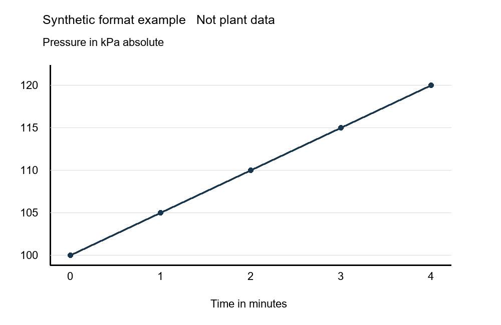

# Broadbridge Oil and Gas multimodal SLM implementation runbook

## AWS 1 Download and run the foundation first

The first deliverable is Qwen3.5-4B downloaded into Broadbridge AWS and running text and image inference. Begin with AWS resources and model acquisition. The revised task schedule targets this milestone by working day 8, assuming the AWS account, GPU quota, network and sandbox spend envelope already exist. Account or quota delays move the date.

Use the selected post-trained image/text checkpoint as the foundation for domain adaptation. There is no need to pretrain a model from scratch. Start with public weights and synthetic examples; expert-content acquisition and licensing proceed alongside the initial AWS work.

| Step | What the engineer does | Evidence of completion |
| --- | --- | --- |
| 1 | Launch AWS GPU host and download the model | Pinned weights stored on EC2 and private S3 |
| 2 | Ask the unchanged model text and image questions | Saved baseline answers and memory measurements |
| 3 | Run a tiny training and save/reload check | Working adapter-training path |
| 4 | Upload and process a small cleared document batch | Reviewed JSONL evidence and PNG figures |
| 5 | Create 400 reviewed training examples and retrieval index | Validated dataset plus measured baseline |
| 6 | Fine-tune an adapter and compare with the baseline | Development-set results justify the change |
| 7 | Expand to 2000 examples and run independent evaluation | Accepted release with documented limits |
| 8 | Deploy privately in AWS and run supervised pilot | Measured quality, cost, feedback and rollback |

The workbook opens with AWS start. Its numbered steps map to the detailed Tasks and Gantt tabs. This opening sequence supersedes the earlier governance-first reading order; the later format recipes and acceptance controls remain in force.

## AWS 2 Create the AWS resources

Implementation choice: use one EC2 GPU instance for the first experiment. This gives the engineer direct access to model files, Python, logs and adapters. Use a separate CPU worker for document parsing and separate serving capacity for the eventual pilot. SageMaker migration is optional after the workload is proven.

| Resource | Initial setting | Action and check |
| --- | --- | --- |
| AWS account and region | Broadbridge sandbox; us-east-1 is an example only | Confirm residency, permissions, G6e availability, On-Demand GPU quota and a named spend owner before launching. |
| EC2 GPU | g6e.2xlarge candidate | One L40S GPU with 48 GB VRAM, 8 vCPUs and 64 GiB host RAM. Measure actual training memory before committing to this size. |
| AMI and disk | AWS PyTorch GPU DLAMI; 300 GiB encrypted gp3 EBS | Choose a current compatible regional AMI and record its ID. Keep durable files on EBS and S3, not local instance-store NVMe. |
| Network | Private subnet with controlled outbound access | No public IP or inbound SSH. Use Session Manager. Provide NAT or approved egress for Hugging Face and package downloads; an S3 endpoint alone cannot reach them. |
| S3 | Four private versioned buckets | MODEL_BUCKET for weights; DATA_BUCKET for raw/extracted/released data; RUN_BUCKET for adapters/logs; EVAL_BUCKET for independent answers. Enable block-public-access and KMS encryption. |
| Identity | Instance role and separate worker roles | Use temporary role credentials. Trainer reads released train/dev only and model artifacts, writes runs, and cannot read EVAL_BUCKET or raw mailboxes. |
| Cost controls | Tags, budget alerts and stop schedule | Tag project and owner. Stop GPU outside booked work, preserve EBS, and archive checkpoints first. Budgets are alerts, not an automatic hard spending cap. |

1. EC2 console → Launch instance → select the documented AWS GPU AMI and instance size. Choose the approved subnet, no-inbound security group, encrypted EBS and instance profile; require IMDSv2. Use the AWS AMI release page to verify publisher and image.
2. Ensure SSM Agent, AmazonSSMManagedInstanceCore-equivalent permissions and outbound SSM connectivity. Open Connect → Session Manager. Run nvidia-smi and aws sts get-caller-identity; save non-secret environment identifiers.
3. Create the four S3 buckets in the approved region. Add per-role S3 prefix permissions and KMS key permissions. Verify permitted reads/writes and explicit inability of the trainer to read test answers. Save aws_environment.json.

## AWS 3 Download the foundation model

Commands below run in Bash on the AWS Linux GPU host, not local Windows PowerShell. Download the AWS starter ZIP from this project, transfer it through approved private storage, and extract it on the host. Set real bucket names, key ARNs and the reviewed revision; no account IDs or credentials have been invented.

### Prepare the working directory and runtime

```text
sudo mkdir -p /srv/broadbridge
sudo chown "$(id -u):$(id -g)" /srv/broadbridge
cd /srv/broadbridge
# Activate the PyTorch environment documented by the chosen AMI.
# Extract Broadbridge_AWS_Start.zip here before the following commands.
bash bootstrap.sh
source /srv/broadbridge/venv/bin/activate
```

bootstrap.sh preserves the AMI Torch version, installs the model libraries, checks CUDA/BF16 and model imports, and records the candidate package set. If the model class is absent, select an explicitly reviewed Transformers release or full Git commit that implements Qwen3.5, then repeat the checks. Do not treat a successful installation as a training-compatibility result.

### Resolve and download a fixed model revision

```text
python foundation_download.py --resolve-only
# Review foundation_revision.json and the model license.
export BB_MODEL_SHA="REPLACE_WITH_REVIEWED_40_CHARACTER_SHA"
python foundation_download.py --revision "$BB_MODEL_SHA"
export BB_MODEL_DIR="/srv/broadbridge/models/Qwen3.5-4B/$BB_MODEL_SHA"
ls "$BB_MODEL_DIR"
```

The download script calls Hugging Face snapshot_download with the exact revision. It obtains safetensors weight shards, configuration, tokenizer and image-processor files; verifies shard references; and writes bb_manifest.json with per-file hashes. The model directory is now the starting foundation inside AWS. Installing a Python library alone would not download these weights.

The model uses the publisher Apache-2.0 license, subject to its terms. Preserve license and attribution records in the snapshot. This license covers the model; permissions for Norm Lieberman articles, emails and client data are separate. Other Hugging Face models are downloaded into separate directories only when required for comparison or retrieval.

## AWS 4 Run the model and retain the baseline

### Archive the exact model in private S3

```text
export BB_MODEL_BUCKET="REPLACE_WITH_MODEL_BUCKET"
export BB_KMS_KEY="REPLACE_WITH_MODEL_BUCKET_KMS_KEY_ARN"
aws s3 sync "$BB_MODEL_DIR/" \
  "s3://$BB_MODEL_BUCKET/foundation/Qwen3.5-4B/$BB_MODEL_SHA/" \
  --exclude ".cache/*" --sse aws:kms --sse-kms-key-id "$BB_KMS_KEY"
```

Compare uploaded object count with the snapshot manifest and verify sampled files after downloading them back. Record the S3 URI. Retain the local EBS copy for loading; from_pretrained loads a local model directory rather than an s3:// URI.

### Run a text question and a synthetic chart question

```text
mkdir -p /srv/broadbridge/runs/baseline
python foundation_smoke.py --model "$BB_MODEL_DIR" \
  --image fixtures/demo_pressure.png \
  --output /srv/broadbridge/runs/baseline/baseline_smoke.json
```

foundation_smoke.py loads the local model and processor, runs a text question and an image question on CUDA, then saves responses, latency and peak GPU memory. It does not fetch proprietary data. Review the chart response against the visible units and trend. Extend B05 with two-image ordering and empty-image checks.

1. Archive the baseline report, package inventory, AMI ID, GPU inventory and model manifest in RUN_BUCKET. First milestone is complete only after actual responses are saved.
2. Next perform B06 and B07 with the synthetic training kit: inspect adapter targets and loss masks, run ten optimizer steps, save and reload. This is the first proof that domain training can work on the chosen AWS environment.
3. Keep base weights unchanged. Save future adapters under runs/RUN_ID/adapter and release manifests under releases/RELEASE_ID. Version base, adapter, processor and runtime together.
4. Stop the GPU when idle through the EC2 console after checkpoints are uploaded. EBS, S3, NAT and other provisioned resources can continue to incur charges. Use measured GPU memory to choose larger hardware only if required.

## AWS 5 Add the oil and gas data next

Once the foundation runs, process a small representative batch end to end. A proposed first extraction batch is about 20 cleared originals. Include a digital article, scanned working paper and engineering diagram; add emails and recordings only when their uses are authorized. This batch is for proving parsing quality, not a claim that 20 files are sufficient for domain competence.

| Location in DATA_BUCKET | What goes there | Next operation |
| --- | --- | --- |
| quarantine/BATCH_ID/ | Original PDF DOCX EML CSV images and manifest | Isolated MIME/malware check and admission by source use |
| raw/SOURCE_ID/ASSET_HASH/ | Accepted immutable original and grant reference | Run the format-specific extractor on CPU |
| extracted/BATCH_ID/ | JSONL text and tables; page/figure PNGs | Review reading order, tags, equations, numbers and units |
| curated/DATASET_REV/ | Case families, annotations and review records | Split case families before producing example variants |
| released/DATASET_REV/train/ | train.jsonl and images/ for approved training families | Trainer copies this exact revision to local EBS |
| released/DATASET_REV/dev/ | Development prompts and permitted evidence | Run baseline and model comparisons; no gradient training |
| retrieval/INDEX_REV/ | Cited chunks, embedding metadata and index export | Load permissioned evidence retrieval; isolate test answers |

Independent test answers live in EVAL_BUCKET, outside trainer and production retrieval permissions. Capture S3 VersionIds and file hashes in each dataset release manifest; a prefix name alone does not prove that a dataset is immutable.

1. Apply the detailed recipes in sections 5–8: PDF/HTML to ordered text and figures; scans to OCR plus images; email to redacted thread records; recordings to reviewed transcripts and frames; numeric exports to typed tables with units.
2. Norm and other experts turn reviewed evidence into cases and teaching examples. Section 10 defines prompt/completion JSONL and image paths. Begin with 400 accepted examples, then expand to 2000 after reviewing initial model errors.
3. Build retrieval alongside the dataset, measure the unchanged AWS foundation, and then run LoRA training on the same pinned base. Section 13 covers model-native token/image processing; section 14 covers the training run.
4. Save the adapter to S3, reload it with the base, compare on development questions, and submit the selected release to independent testing. Only then deploy an authenticated internal service and start the supervised pilot.

## 1 Implementation instructions and schedule

This runbook supplies the missing implementation layer beneath the CTO plan. The companion workbook contains 70 tasks with inputs, instructions, outputs, acceptance checks, dependencies, accountable owners, reviewers, effort and an editable weekly Gantt. The format-examples ZIP demonstrates the file contracts on original synthetic data. Source acquisition, production parsing, GPU training and deployment remain implementation work.

The earlier 24-week schedule was a top-level target. The AWS-first task order and daily effort limits now produce a proposed 152-working-day baseline, about 31 weeks. Gate dates are calculated from the workbook inputs. B01-B07 assume an already authorized AWS sandbox and run alongside source/business mobilization. G0 controls admitted source work. Rebaseline the 24-week budget and first-eight-week funding limit before execution.

| Decision | Calculated baseline | Required evidence |
| --- | --- | --- |
| G0 | Day 10 / week 2 | G0 authorize baseline work |
| G1 | Day 47 / week 10 | G1 accept working baseline |
| G2 | Day 60 / week 12 | G2 authorize adaptation tranche |
| G3 | Day 114 / week 23 | G3 freeze release candidate |
| G4 | Day 133 / week 27 | G4 authorize supervised internal pilot |
| G5 | Day 152 / week 31 | G5 decide continuation |

1. Open Start here. Enter an approved kickoff date; leave it blank to use working-day offsets. Weeks are five working days; weekends are excluded and holidays are not yet modeled.
2. Use Tasks for status, estimates and dependencies. Task detail contains the actual procedure and acceptance evidence. Use Source routing and Processing recipes to decide how each existing lead is handled.
3. Daily leveling assumes up to 8 hours per named role and 24 pooled expert/reviewer hours. These are peak reservation assumptions, not new hires. Source authors and independent reviewers must be separate people.
4. Review Capacity after changes. The formulas propagate dependencies but do not automatically re-level resources after edits. Reassign or move tasks if weekly demand exceeds confirmed capacity.
5. Compress the schedule only with an already-cleared corpus, earlier case production, validated tools, or additional explicitly funded capacity. Do not compress independent review by removing it.

## 2 Repository storage and toolchain

Use a private Linux GPU environment for model work and an isolated CPU worker for source processing. Keep the original file, its derivatives and its permissions traceable. Source files are evidence; model weights are a separate software dependency. Never upload proprietary data to a public Hub repository.

| Area | Contents and access |
| --- | --- |
| raw | Immutable originals, acquisition evidence and asset hashes. Intake identity writes; ordinary users cannot browse. |
| extracted | Parser JSON, OCR text, page images, tables and figure regions. Still inherits source restrictions. |
| curated | Reviewed evidence, case packets, split manifests, approved train/dev JSONL and image assets. |
| retrieval | Authorized chunks, lexical/vector indexes and citation mapping. Access groups are enforced outside the model. |
| models and runs | Pinned base snapshots; dependency locks; configs; adapters; logs and evaluation IDs. No raw mailbox or full client archive. |
| evaluation | Separate evaluator prompts and gold answers. Trainer, teacher and production retrieval identities have no answer access. |

### Implementation choices to prove in the baseline

Use Python workers and a versioned object store with a PostgreSQL metadata catalog. Docling is the extraction candidate for PDFs and office files; test OCR/layout quality on actual engineering pages. Use Python email parsers for EML/MBOX, PyArrow for typed measurements, and an approved transcription engine for recordings. Use PostgreSQL full-text plus a vector index initially; retain exact embedding revision and dimensions.

Model tooling: PyTorch, Transformers, TRL, PEFT, Datasets, Accelerate and Pillow, with CUDA/driver compatibility verified together. GPU sizing follows a real processed batch, not parameter count alone. Separate training and serving dependency locks. Model-card examples may use development branches; select and pin a working commit instead of leaving main floating.

Tasks B01-B07 create these environments. Record container digest, OS, GPU, driver, CUDA, package versions, model and processor hashes, and successful train/save/reload results in compatibility_report.json. A successful inference call alone does not prove training compatibility.

## 3 Source admission and the existing documents

Start from the 51 source leads already identified: 32 general entries and 19 Norm Lieberman entries. The Source routing sheet preserves their IDs and URLs. It is a disposition register, not a claim that files have been acquired or training permission obtained.

1. Inventory the exact item: author, coauthor, title, edition/date, publisher, original URL, current custodian and any former-client material. Use separate assets for attachments and third-party figures.
2. Record permitted acquisition, local storage, OCR, retrieval, training, evaluation, derivative weights, internal users, processors, retention and revocation. Link the actual grant or terms evidence. Public availability is not an admission flag.
3. Assign allowed routes. A retrieval-only grant permits authorized retrieval; it does not permit exporting that text into SFT. Model licenses, software licenses and source-content rights are separate records.
4. Obtain the authoritative full asset through permitted access. Log acquisition time and checksum. If only a catalog, preview or search snippet is available, keep an acquisition lead; do not create technical answer labels from missing pages.
5. Choose the recipe in the workbook, admit the allowed uses and retain denied uses. Use an explicit state transition signed by the responsible owner; never let an ingestion script infer legal permission.

| Existing lead | Concrete implementation route |
| --- | --- |
| N02-N08 and N18 OGJ articles | Obtain cleared full article; apply R01; create evidence blocks and reviewed cases only for granted uses. |
| N09-N11 N13-N17 N19 | Acquire full authoritative paper/chapter/article first. Catalogs, previews and unverified issue boundaries stay R11. |
| N12 video library and K01 expertise | Separate grants for recordings, frames, quizzes and original interviews. Transcript/frame route R07; quizzes chosen for tests remain isolated. |
| P01-P05 public references | Review the exact document and third-party credits; use R01/R02 after clearance. P04 incident questions separate pre-event evidence from hindsight. |
| M01-M06 models and P07-P08 tools | Download model snapshots via R09; build checked software tools via R10. Neither is an article-ingestion task. |
| D01-D06 and M07-M09 | Preserve existing holds, exclusions or later/evaluation-only dispositions. No automatic bulk download or commercial-use inference. |

Norm Lieberman remains an illustrative expert candidate. Original contracted cases are a preferred acquisition route; published works may require publisher and coauthor permissions. The plan assumes no appointment or granted rights.

## 4 Intake state machine and repeatable processing

| State | Entry action | Output and exit condition |
| --- | --- | --- |
| Discovered | Register a lead and its rights questions. | source_id created; no content ingestion approval. |
| Acquired in quarantine | Authorized copy; hash, MIME check and isolated malware scan. | asset_id and original bytes; safe to parse under approved use. |
| Admitted | Verify grant, intended route and access boundary. | Signed use flags; unknown or expired grants stay held. |
| Extracted | Run the recipe on an immutable original. | Text/tables/images plus parser revision and output hashes. |
| Normalized | Check order, symbols, metadata, units and duplicates. | Canonical evidence with source locators and family ID. |
| Reviewed | Technical reviewer accepts facts/labels and limitations. | Case/evidence review state; rejected regions remain visible. |
| Released | Freeze split, permitted-use manifest and dataset/index revision. | Only approved route-specific artifacts reach retrieval or trainer. |

1. Assign IDs deterministically: source item, asset hash, page/region, case family, chunk and example. Store source URLs as metadata, never use a changing URL as the only identity.
2. For every run store batch_id, input SHA256, parser/version, configuration hash, timestamp, rights version, output paths/hashes, success/failure and reviewer decisions.
3. Make each worker idempotent on input hash plus parser/config/rights revision. Retry failed or changed items. Never append duplicates because a job was restarted.
4. Place parsing failures, unreadable pages, missing figures and expired grants in a rejection queue with reason and owner. A zero-length extraction is a failure, not a successful empty document.
5. When a grant changes, find every descendant chunk, image, example, index, run and adapter. Delete/restrict retrieval copies and caches. A trained parameter cannot be assumed to forget a source; retire or retrain the affected adapter when required.

Tasks C01 and C12 build the intake handler and audit controls. Required negative checks include a duplicate file, a renamed duplicate, a malicious document, a missing attachment, a revoked source and an interrupted batch restart.

## 5 PDFs HTML and scanned pages

### Digital source recipe R01

1. Keep the original PDF or permitted HTML snapshot. Record edition, full article boundaries and acquisition rights. HTML extraction removes menus and repeated site navigation, not authorship, qualifications or reference notes.
2. Extract native text and layout first. Save a canonical JSON representation containing ordered blocks, page number, bounding box, tables, headings and figure captions; save Markdown only as a readable review view.
3. Export figures and page renders as PNG where text and lines matter. Link each image to page, original coordinates, caption and source ID. Preserve the full page for audit even when a training example uses a crop.
4. Represent tables as cells with row/column indices, headers, merged-cell interpretation, units and footnotes. Keep a rendered table image as evidence; do not flatten a complex table into an ambiguous stream.
5. Compare every page count and all critical numeric regions with the original. For the first batch inspect every page; after stable extraction, keep complete automated checks plus risk-based human page sampling and 100% review of critical values used in labels.

### Scan recipe R02

1. Render pages near 300 dpi as a starting acquisition setting. Preserve original pixels; orientation/deskew/contrast changes create derivatives with recorded transforms. Do not discard margins containing units, legends or revisions.
2. Run OCR in the approved environment. Retain region coordinates and OCR quality flags. Handwriting, equations, small tag text and line crossings require human verification; OCR confidence alone cannot approve engineering content.
3. Normalize to a documented coordinate convention: page number 1-based; bounding boxes in original-image pixels with top-left origin; retain width/height and each crop-to-original transform.
4. Flag uncertain characters and missing information explicitly. Do not let an LLM silently repair a pressure value, exponent, minus sign or flow arrow. Preserve extracted_raw and reviewed_text separately.

Outputs: documents.jsonl, regions.jsonl, page PNGs, figure PNGs, structured table JSON and an extraction audit. A PDF is not directly supplied to the SFT trainer. Reviewed passages and images later become examples or retrieval evidence. Tasks C03-C04 and C10 implement these steps.

## 6 Work papers emails and recorded expertise

### Office files and work papers

For DOCX/PPTX, extract paragraphs, tables, slide notes, drawings and image relationships. Save a fixed-layout preview for review and preserve the native original. Decide explicitly whether tracked changes, comments, speaker notes and hidden slides are included. Equations retain a source image and a reviewed transcription with variables and units. Calculations must be independently recomputed before they become answer labels. Implement in C05.

### Email threads

1. Use an authorized EML/MBOX export. For MSG/PST, use an approved export tool first; do not assume a document parser can safely read the mailbox container.
2. Parse MIME structure, Message-ID, In-Reply-To, References, From/To, timestamps and attachments. Preserve timezone and thread order. Resolve linked documents only under separate authorized acquisition.
3. Replace repeated quoted bodies with references to earlier messages while retaining the original. Remove signatures and personal details from the training derivative, preserving necessary professional role context.
4. Create a case packet with facts known at the question time and the later diagnosis/outcome in distinct fields. A later email answer must never appear in the diagnostic prompt.
5. Review permissions for each correspondent, client details and attachment. Export redacted thread JSONL and evidence spans; create teaching records only after technical and rights review. Implement in C07.

### Interviews audio and video

1. Agree the capture brief and recording/reuse permissions before recording. Ask for symptoms, context, alternatives, decisive observations, failed approaches and limits of the lesson.
2. Transcribe with time offsets and speaker IDs using an approved processor. Have the expert correct names, equipment tags, technical terms and numerical statements against the audio.
3. Export segments containing start/end time, speaker, text and source ID. For video, select instructional frames at known times; preserve diagrams at usable resolution and link to the related transcript.
4. Create text or image/text cases from the approved transcript and frames. Raw audio/video is retained as evidence; it is not an input modality for release-one SFT. Implement in C09.

Keep the expert account and independent reviewer assessment distinct. If the expert disagrees with a label, preserve and adjudicate the disagreement; do not turn it into a supposedly settled answer.

## 7 Diagrams photographs and measurement data

### Visual annotation recipe R05

1. Retain the native drawing and an approved image export. Record drawing revision, equipment/system, orientation and confidentiality. Treat CAD objects as separate structured data; do not assume their attributes are visible in a raster image.
2. Select an overview plus at most two relevant crops as the initial annotation policy. Keep tags, legends and connecting line segments inside the selected regions. The processor pixel/token budget may require fewer or smaller crops.
3. Annotate visible equipment tags, values/units, arrow direction, line/edge endpoints, region coordinates and legibility. Label a crossing without a clear junction as ambiguous. Mark unreadable text rather than guessing it.
4. Pair the view with a specific task: locate a tag, extract a stated value, identify a bounded connection, compare evidence or ask for missing information. Avoid teaching unrestricted whole-plant connectivity from one sheet.
5. Have an independent engineer compare labels with the original. Wrong diagram rotations, mirrored images and arbitrary geometric augmentation can change meaning and are excluded.

### Numeric recipe R06

1. For CSV/XLSX/historian exports, preserve values, source timestamps, timezone, sampling interval, sensor quality, units and basis. Export formulas and calculated values separately when spreadsheets contain both.
2. Use typed Parquet columns for bulk measurements; use CSV for small review exchanges. Record tag, event_time, value, unit, quality and source_revision. Missing readings are null, not zero.
3. Normalize units only with a documented reversible transform. Preserve gauge versus absolute pressure and actual versus standard flow conditions. Record assumptions and conversion version.
4. Align trends only with an explicit resampling/interpolation rule approved for the task. Preserve original series and report gaps. Calculate from numbers, not visually estimated pixels, when the numbers are available.
5. Generate a labeled PNG plot from the checked table. Link plot, numeric data and time window. Train visual observations on the image; route quantitative calculations to the checked numeric tool.

C06 and C08 produce reviewed visual_labels.jsonl, image assets, measurements.parquet and data_dictionary.json. Equipment photographs may support bounded observations, but this pilot does not certify damage severity, dimensions or fitness for service from pixels.

## 8 Canonical records and quality checks

Use UTF-8 JSONL for reviewable record exchanges: one complete JSON object per line, no comments and no trailing commas. Use JSON for schemas/manifests, Parquet for large typed tables, and PNG/JPEG files for images. JSONL is the storage contract; a Python dataset plus decoded images is the trainer runtime contract.

| Record | Required fields |
| --- | --- |
| Asset | asset_id; source_id; source hash; MIME; original path; grant_id; acquisition timestamp; edition; permitted uses; access groups; parent asset; derivative transform. |
| Evidence block | block/chunk ID; original asset; family; page/region or time locator; raw and reviewed text; table/image IDs; units; revision; review state. |
| Case family | family_id; parent incident/publication/scenario; source assets; topic/equipment; known-at-question-time facts; outcome; split; all derivative IDs. |
| SFT example | example_id; family_id; split; source/evidence/grant IDs; review provenance; image_paths; prompt messages; completion messages; schema version. |
| Evaluation task | task_id; family; prompt evidence; expected evidence/answer in evaluator-only store; tolerances; critical-error rubric; subtype; author/reviewer. |
| Model run | run_id; model SHA; processor/config hashes; dependency lock; data snapshot; target modules; seed; learning parameters; GPU/time/cost; checkpoints. |

### Admission checks before any export

Verify unique IDs, allowed route, nonexpired grant, asset existence and hashes, schema types, timestamps and units. Compare row/column context and equation variables to originals. Preserve source-to-derivative lineage. Reject a reviewed answer with no supporting evidence or an image label outside its parent region.

Use exact file hashes for identical assets and normalized-text/image similarity to identify candidate near duplicates. An engineer resolves similarity clusters. Republishing the same incident, cropping its diagram or generating ten paraphrases does not create ten independent case families.

Schema validity is necessary but does not prove technical truth. Every production SFT answer needs an identifiable independent review. A release contains accepted and rejected counts, reasons and coverage statistics. C10-C12 and D09 implement these checks.

## 9 Case construction splits and leakage control

1. Create the family before generating questions. Group an incident, its article, email follow-ups, diagrams, revisions, crops and synthetic variants under one family. Group a parameterized synthetic scenario by shared template/underlying event as appropriate.
2. Assign 180 families to training, 60 to development and 60 to locked testing. Keep at least 90 usable visual families among the 180 training families and 30 among each 60-family dev/test partition. If sources cannot support that inventory, change the scope or schedule; do not inflate paraphrases.
3. For each case, record operating regime, what was observed, what was unknown, alternatives, discriminating checks, outcome and limitations. Make question-time evidence explicit; keep later outcome evidence out of the prompt.
4. Generate teaching variants only after the family split. Use existing approved evidence and concise checked explanations. Optional model-generated drafts retain teacher/version/prompt/source metadata and require expert review.
5. Build 2,000 training examples from training families only. Development and test prompts are additional records. Use development data for configuration choices; open locked tests only after freezing the candidate.
6. Keep test-family answer material out of SFT, teacher prompts, retrieval indexes, tool caches and general developer logs. Evaluator questions may contain authorized evidence needed to solve the task, but the gold answer remains isolated.
7. Run exact and near-duplicate checks over all exported surfaces. If a locked test reveals a defect, fix it and use fresh held-out cases for the affected generalization claim; preserve the old test only as a regression check.

| Training curriculum | Text | Image and text | Total |
| --- | --- | --- | --- |
| Diagnostic work | 625 | 275 | 900 |
| Missing evidence questions | 300 | 100 | 400 |
| Checked tools and calculations | 225 | 75 | 300 |
| Source grounding | 170 | 30 | 200 |
| Escalation and scope | 180 | 20 | 200 |
| Total | 1500 | 500 | 2000 |

D01-D09 implement the case inventory, split manifests, authoring and audit. Keep case-family counts and example counts separate in reports. Public benchmark performance is supplementary and cannot establish refining competence.

## 10 Exact supervised training file format

The authoritative record is canonical JSONL containing prompt, completion and image_paths plus governance fields. A prompt is the question with the information available to answer it. A completion is the independently reviewed target response. The loader sends only model-input fields to the trainer.

```text
{"schema_version":"bb-sft-1","example_id":"EX-0001",
 "family_id":"F-001","split":"train",
 "purpose":"production_candidate",
 "source_ids":["SRC-001"],"evidence_ids":["EV-001"],
 "grant_ids":["GRANT-001"],
 "review":{"state":"accepted","author":"author-id",
   "reviewer":"independent-id","technical_approval":true},
 "image_paths":["images/figure-001.png"],
 "prompt":[
   {"role":"system","content":[{"type":"text",
     "text":"Use supplied evidence and cite its ID."}]},
   {"role":"user","content":[{"type":"image"},
     {"type":"text","text":"Describe trend EV-001 and its limits."}]}],
 "completion":[{"role":"assistant","content":[
   {"type":"text","text":"Reviewed answer with citation [EV-001]."}]}]}
```

The block above is valid JSON formatted for reading. JSONL stores each complete object on one physical line; the ZIP contains actual parseable examples. The grant and people IDs above illustrate the fields and do not represent approvals.

1. For text-only records, image_paths is [] and there is no image placeholder. Keep content blocks consistently typed. Do not add blank dummy images.
2. For visual records, the number and order of image placeholders must match image_paths. The ZIP loader opens each approved local image, converts it to RGB and returns images as a list of PIL image objects.
3. The runtime dataset has prompt, completion and images columns. Do not pass filenames as if the model can read them from text. Do not fetch arbitrary remote image URLs during training.
4. Preserve metadata in the canonical registry but strip it from the model input unless the task intentionally needs a field. Validation answers and rights documents never become prompt text.
5. Use the model-specific processor and chat template at batch time. Do not manually insert guessed image special tokens or pre-embed pictures into a text-only CSV.

For tool-call training, use the selected model’s actual tool-message schema plus a tools schema column and validated tool responses. Implement and smoke-test that adapter separately; the supplied minimal schema intentionally covers text/image brief training only.

## 11 Retrieval ingestion and engineering tools

### Document evidence goes into retrieval before training

1. Read only admitted, reviewed evidence blocks. Split by semantic heading, starting with 400-800 model-token chunks and about 80 tokens of overlap where needed. These are tuning defaults, not required standards. Keep a table and its headers together or create explicit row groups.
2. Assign chunk_id and retain text, source/asset IDs, page/region, image IDs, family, revision, grant, access groups and split. A citation resolves through this mapping to the original.
3. Use the pinned embedding model to compute text vectors. Store vector dimension, model SHA, normalization and query/document formatting. Never mix vectors from different embedding revisions in one unversioned index.
4. Index approved text in a lexical index and approved vectors in a vector index. Filter user/project permissions, grant status and excluded test-family material before candidate retrieval, not merely after model generation.
5. Retrieve a candidate set, initially 20 passages, then rerank authorized candidates and select a smaller context set within the model budget. The reranker does not receive unauthorized candidates.
6. Build a context pack with cited passages and approved image regions. Text embeddings alone do not provide image understanding; image assets reach the VLM through retrieved region links or user-selected authorized evidence.
7. Evaluate recall on engineer-labeled development queries. Start with a 90% recall@20 target and inspect misses before changing chunking, embeddings or reranking. Rebuild/version the index when the embedding model changes.

### Engineering calculations follow a separate route

P07 CoolProp and P08 IDAES are software candidates. Pin code, dependencies and any property backends; review the selected equations and validity ranges. Expose only named tools with typed inputs, explicit units, range checks and reproducible outputs. Independently validate a small reference set before creating synthetic examples from results.

Store tool name/version, input values/units, method, output values/units, validity flags and evidence in ToolResult JSON. A failed calculation is returned as an error with missing inputs, not replaced by model-generated numbers. Tool outputs may be supplied in training examples only after validation. E01-E06 implement this path.

Retrieval is read-time access to evidence; SFT changes model behavior. A searchable chunk is not automatically a good training example. Revocable, frequently changing or customer-specific facts generally remain in permission-controlled retrieval.

## 12 Hugging Face model acquisition and setup

The primary candidate is Qwen/Qwen3.5-4B; Qwen/Qwen3-8B is the text control. The embedding and reranking candidates are Qwen/Qwen3-Embedding-0.6B and Qwen/Qwen3-Reranker-0.6B. Ministral 3 remains an alternate requiring its own format/training compatibility test. The selected model is downloaded as weights and configuration, not copied into the training-data folder.

1. Review the exact model card, license and dependency requirements. Record repository ID, full commit SHA, purpose, approver and download date in model_manifest.json. Resolve the SHA from the repository; do not invent a version or leave main as the release revision.
2. Download original safetensors shards, shard index if present, config, generation config, tokenizer assets, chat template, processor/image-processor assets and notices. Keep all referenced assets needed to load. The supplied download_model.py requires APPROVED_MODEL_REVISION.
3. Verify hashes and shard completeness. Store model files privately under models. Reject unreviewed executable repository code; load with trust_remote_code=False when supported. A pickle-style checkpoint needs a separate security decision.
4. Create a compatible locked GPU environment. If the model requires unreleased Transformers/runtime code, use an approved exact commit and record the exception. Start with model-native precision; do not substitute an arbitrary GGUF or third-party 4-bit inference build for training.
5. Load the processor and model from local paths. For the reference Qwen path, the documented class is Qwen3_5ForConditionalGeneration with AutoProcessor. Test text, one image, two ordered images and a text-only row in a mixed batch.
6. Record GPU memory, processed lengths and response shape. Inspect language module names for LoRA targets. Run ten optimizer steps, save, reload and compare outputs before approving the compatibility matrix.

```text
# Reference download after approval and a pinned environment
export APPROVED_MODEL_REVISION=<full approved commit SHA>
python templates/download_model.py

# Local loading pattern for the selected Qwen model
processor = AutoProcessor.from_pretrained(
    base_dir, local_files_only=True, trust_remote_code=False)
model = Qwen3_5ForConditionalGeneration.from_pretrained(
    base_dir, local_files_only=True, trust_remote_code=False,
    torch_dtype=torch.bfloat16)
```

These commands are implementation instructions for the project environment. No weights were downloaded or GPU execution performed while creating this plan. B02-B07 provide the required acceptance evidence.

## 13 From JSONL to a model training batch

1. Validate canonical records first: schema, allowed SFT use, review approval, unique example IDs, family partition, image hashes and local paths. Resolve evidence and grant IDs. Refuse test records on the training host.
2. Load JSONL as structured records. Decode every image to RGB and keep images in placeholder order. Build a Hugging Face Dataset containing prompt, completion and images. Keep the larger provenance record outside the trainer.
3. Apply the model’s own processor/chat template to representative text-only, one-image, two-image and mixed batches. The processor handles tokenization, image resizing/patching and required image tensors. Do not use a generic text tokenizer as a replacement.
4. Inspect the full processed sequence length including image expansion. The proposed initial admission cap is 8192 tokens. Reject or restructure over-budget records before training; include an overview only if it fits. Record actual pixel policy and measured image-token counts.
5. Use prompt/completion training with completion-only loss. Verify the collator masks system/user context, image placeholders/tokens and padding while leaving the intended answer tokens supervised. Inspect actual tensors for this model revision.
6. For each audited batch, decode the supervised label positions and compare with the intended target answer. Check that no answer text was accidentally included in prompt evidence and no target answer disappeared behind a mask.
7. Use no packing initially. For VLM training, set trainer max_length=None only after enforcing the dataset-level cap; this prevents a later generic truncation from cutting required image tokens. Fail on oversized batches rather than silently trimming them.
8. Run a forward/backward pass. Require finite loss, expected trainable gradients and acceptable peak GPU memory. Then complete the ten-step save/reload test. Retain the batch audit as release evidence.

| Before processor | After processor and collator |
| --- | --- |
| prompt and completion message objects | input_ids and attention_mask; model-specific conversation markers. |
| images as ordered decoded image objects | Model-specific pixel tensors and grid/patch metadata. |
| Reviewed target answer | labels with ignored positions masked to -100; target positions supervised. |
| Asset/case metadata | Audit record outside the input tensors; not a hidden source of answers. |

F03 and B06 own this boundary. Exact tensor keys depend on the model. The CPU fixture validator cannot verify token expansion, masks or GPU compatibility; the actual processor/collator tests are mandatory implementation tasks.

## 14 Fine tuning experiments and execution

Begin with the existing vision-language model and LoRA adapters on audited language layers. Freeze the visual encoder and projector initially. List exact target modules from named_modules and verify that their names belong to the language stack. Avoid an indiscriminate all-linear target that also changes the vision system.

| Initial proposal | Value or implementation rule |
| --- | --- |
| Data | Approved train release; dev used for selection; no test mount. |
| Precision | BF16 when the GPU and model support it. QLoRA is a separate memory-saving experiment, not an automatic format conversion. |
| Adapter | Rank 16; alpha 32; dropout 0.05; no bias; explicit language module list. |
| Optimization | One epoch; learning rate 5e-5; batch 1 per device; accumulation 16; seed 17. Effective batch equals batch × accumulation × GPU count. |
| Sequence handling | Preflight cap 8192 processed tokens; max_length=None after admission; packing=False; completion_only_loss=True. |
| Experiment bounds | Compare ranks 16/32 and LR5e-5/1e-4; at most eight development configurations per finalist; repeat the selected recipe with three seeds. |
| Tracking | Base/processor/data/code hashes; config; trainable parameter count; loss; dev scores; GPU memory/hours; cost; checkpoint IDs. |

1. Run the baseline system with retrieval/tools before adaptation. Compare the text control and the same VLM with OCR-only versus image input to isolate the value of vision.
2. Use 100/200/400-example family-grouped subsets for a pilot learning curve. Diagnose source, extraction, retrieval, label, perception and tool errors separately. More epochs cannot fix a wrong label.
3. Implement the reference recipe on the approved GPU environment. The ZIP template requires a separately created approved_training_config.json tied to saved approval/test evidence. It is not a substitute for B02-B07.
4. Stop on NaN/infinite loss, broken masks, image-count mismatch, leakage, unexpected trainable modules, exceeded spend or critical development regression. Preserve logs and classify the failure.
5. Train the selected final recipe on the frozen 2,000-example release. Compare tuned and untuned versions using identical evidence/tools. Retain adaptation only if it yields the proposed five-point acceptance or 15% reviewer-time improvement at matched quality.
6. Freeze the candidate and all dependencies before independent test evaluation. Do not choose a checkpoint using the locked test answers.

F04-F08 produce experiment configurations, reviewed development results, adapter checkpoints and a reproducible candidate. Learning rate, batch and image budget are starting proposals to validate, not guaranteed optimal settings.

## 15 Model export reload and deployment package

1. Save the PEFT adapter as adapter_model.safetensors with adapter_config.json. Preserve the exact base model revision and any additional saved modules. An adapter alone is not a complete standalone model.
2. Save the processor/tokenizer/chat template used for training with the release. Include dependency locks, module targets, dataset manifest, evaluation reports and approved generation settings.
3. Reload the base plus adapter in a fresh process and environment. Test deterministic text and visual fixtures, compare outputs/logits within a defined numerical tolerance and verify the intended adapter weights are active.
4. Use the proven Transformers path first. Adopt vLLM or another serving engine only after its exact architecture, multimodal processor and LoRA support pass compatibility tests. Model-card inference examples do not establish support for the trained adapter.
5. If deployment requires merging or quantization, create a new derived artifact with parent hashes. Confirm supported merge behavior and re-evaluate quality, image handling, memory and latency. Never label a quantized artifact equivalent without testing.
6. Serve through an authenticated internal application. Apply request limits, permission-filtered retrieval, allowed tool schemas and a validated DiagnosticBrief response. Reject unrecognized tool names and unauthorized evidence IDs server-side.
7. Version the entire system: base, adapter, processor, prompt, retrieval index, tool runtime, code and security configuration. A rollback restores a compatible package, not just a weight file.

| Release file or record | Purpose |
| --- | --- |
| release_manifest.json | All component hashes and technical/security acceptance IDs. |
| adapter files plus base reference | Learned parameter changes and the exact underlying model needed to use them. |
| processor and dependency lock | Reproduce the image/text representation and runtime. |
| dataset card and rights manifest | Training provenance, permitted use, exclusions and limitations. |
| evaluation and operations records | Quality evidence, user instructions, monitoring, restore and rollback procedures. |

H02-H03 implement the service and F08 validates the export. The Head of Product and AI owns release; Technical Director and parent security acceptance are prerequisites. No plant-control write path is included.

## 16 Independent evaluation implementation

1. Freeze the candidate and evaluation protocol before opening the locked set. Use 120 tasks from 60 independent held-out families: 60 visual tasks from 30 families and 60 text tasks from 30 families. Keep 180 separate challenge prompts for visual, grounding/tool/scope and security behavior.
2. Separate prompt files from evaluator gold files. The inference service receives only task evidence and the question. Record prediction, citations, tool calls, latency and release ID in predictions.jsonl.
3. Have two independent qualified reviewers score material diagnostic cases. Reviewers do not certify their own authored work. Blind model identity and counterbalance task order to reduce familiarity effects in time comparisons.
4. Use fixed denominators and legibility labels defined before model execution. Unnecessary refusal on a sufficient-evidence task counts as failure. Refusing a preclassified legible field counts as a missed extraction; the model cannot exclude hard cases itself.
5. Score diagnostic usefulness, material-claim grounding, exact critical tag/unit/value extraction, bounded edge precision/recall, numeric correctness, appropriate escalation and critical failures. Store item-level decisions and adjudications.
6. Measure performance on the declared input workload and hardware, including image-token cap, five concurrent users, up to three tool calls and an 800-token output target. Separate model latency from full reviewed-brief effort.
7. Report family-clustered paired comparisons and uncertainty, not just aggregate percentages. Inspect every modality and equipment slice. A finite zero-critical-error result does not establish that failures are impossible.
8. If locked testing triggers a material correction, obtain fresh held-out tasks for affected claims. Use exposed tasks for regression only. Defer the gate if new independent evidence or reviewer capacity is unavailable.

| Proposed acceptance measure | Threshold |
| --- | --- |
| Diagnostic tasks accepted without material correction | At least 85% |
| Material factual claims supported by evidence or checked tools | At least 95%; zero fabricated source IDs |
| Legible critical tags units values and numeric tool tasks | At least 98% |
| Bounded connection precision and recall; correct escalation | At least 95% for each |
| Critical errors unauthorized disclosure or actions | Zero observed in gate suite; no unresolved high security finding |
| Runtime and workflow | p95 brief within 60 seconds on declared workload; target 25% less review effort |

These are Broadbridge proposals, not statutory or industry-mandated thresholds. D08 and I01-I04 implement the evaluation and remediation records.

## 17 Security monitoring and operational handoff

Build controls into every data transition and the application. A prompt telling the model to respect confidentiality is insufficient. Training data permissions and application access are enforced by identities, storage policies, retrieval filters and service code.

1. Test user/project isolation across originals, extracted text, image URLs, retrieval candidates, reranking, caches, exports and logs. An image must inherit the same restrictions as its source text.
2. Test prompt injection embedded in a document, table, diagram and OCR text. Treat source content as data. Only the application can authorize tool calls, routes or grants.
3. Keep source/model downloads in a controlled acquisition job. Disable arbitrary browsing and shell execution in the engineering assistant. Apply resource limits and allowlisted tools. Scan packages and model artifacts; preserve software inventory.
4. Track request/release/evidence IDs, latency, input size, tool failures, rejected briefs and reviewer corrections. Limit sensitive prompt logging and define retention before use.
5. Quarantine user feedback. Reconfirm source rights, group it into the existing family, have an independent reviewer approve it and release through the normal dataset process. Never automatically retrain from accepted chat messages.
6. Exercise backup restore and rollback before pilot approval. Demonstrate the proposed four-business-hour recovery and 24-hour maximum loss for review records, or revise those service targets explicitly.
7. Disable the affected capability for a credible critical engineering defect or disclosure. Notify the Technical Director or security lead; preserve restricted audit evidence; repair and repeat acceptance before restart.
8. Create one release record with technical acceptance, security acceptance and product release authorization. The MD controls operating commitments and funding; expert council influence does not override formal decision rights.

B01, E06, H04 and I02/I05/I06 supply access tests, revocation proof, monitoring, incident procedures and the release package. The production implementation must demonstrate each control on actual services; the format examples do not implement them.

### Gate evidence to retain

Save access matrix and negative tests; dependency/container scans; malicious-document handling tests; prompt-injection results; validated tool tests; source revocation tests; data/adapter lineage; restore and rollback logs; named on-call contacts and user instructions.

## 18 Pilot execution and task completion

1. Before pilot access, name the internal users, available reviewers, accepted use cases and service window. Explain what constitutes an unsupported answer and how to inspect the original evidence.
2. Onboard a target of ten internal users using a supervised sample. Require evidence inspection, unit checking and acceptance/rejection before a brief enters engineering work.
3. Collect a target of 100 reviewed briefs over the four-week pilot period including onboarding and closure. Record task complexity, accepted/rejected status, correction type, review time, cited evidence, model release and any escalation.
4. Second-review a weekly sample and all critical incidents. If the service generates a critical unsupported result, suspend the affected function; average usefulness cannot override the technical veto.
5. Compare observed effort with the manual baseline for comparable tasks. Count unsuccessful attempts and correction time. Report infrastructure plus review labor per accepted brief and a continuing service forecast.
6. Use pilot evidence to decide continue, narrow or stop. Future external customers, additional modalities or new practices require separate scope, data rights, evaluation and funding decisions.

### A task is complete only when its output exists

The workbook status field starts at Not started. Change it only when the stated acceptance evidence exists and the designated reviewer has accepted it. The Gantt dates are estimates, not proof of completion. Link the evidence record in the task blocker/evidence field. Do not mark a task complete because its scheduled end date has passed.

### Resource and cost interpretation

The detailed schedule contains owner effort and separate reviewer effort. The Capacity sheet compares estimated assigned hours with the earlier program-hour envelope and shows weekly peaks. Unassigned hours are not savings: they cover coordination, iterations, additional review, operations and uncertainty. Contractor estimates are capacity placeholders, not agreed appointments.

The prior 4.25 FTE average and 24-week budget do not automatically fund 31 weeks. At G0 reconcile salaries, protected time, expert availability, hosting duration and the first-eight-week spend limit. The current schedule assumes cleared initial assets are available at intake. Rights negotiations and unavailable experts can delay it further.

### First practical handoff

Assign A01-A07, approve the environment and grants, then implement B01-B07 and the initialC/D/E tasks. Run the supplied CPU fixture demonstration to establish the data contract. Replace its synthetic records only with admitted, independently reviewed production candidates.

## 19 Worked format example and supplied files

The ZIP includes a five-row synthetic pressure CSV, a plotted PNG, asset/evidence manifests, two actual JSONL teaching examples, a schema, a CPU validator and reference model-loader/training templates. There is no proprietary publication, customer information or claimed real-world diagnosis in the example.



1. Follow raw/demo_measurements.csv into images/demo_pressure.png. Evidence manifests retain the original and derived hashes, source relationship and citation ID.
2. Read curated/train_demo.jsonl. One record asks about stated numeric values; the other asks for a bounded visual observation and what cannot be inferred. They share one family.
3. Run python validate_and_preview.py in an environment with Pillow and jsonschema. Expected output is two valid demo records, one image record and runtime columns prompt/completion/images.
4. Review templates/load_dataset.py to see local paths become actual image objects. Review download_model.py for the pinned snapshot acquisition step.
5. Review train_reference.py as an implementation starting recipe. It requires a separate approved configuration and real GPU compatibility, token, mask and reload tests. It has not been run against model weights here.

The example validator checks structure and file integrity. It cannot confer rights, independently certify technical content or validate model behavior. Do not count the fixture toward 2,000 examples or 300 families. The evaluation file is a format template, not an actual held-out test case.

## 20 Technical references and implementation boundaries

Official documentation checked 23 September 2026. Exact package/model versions are intentionally selected through compatibility tasks rather than invented in advance. The specific file contracts, batch policies, schedules and acceptance checks in this runbook are Broadbridge implementation proposals.

- HF01 [Qwen3.5 candidate model](https://huggingface.co/Qwen/Qwen3.5-4B): Model artifacts and publisher runtime guidance
- HF02 [Qwen3.5 Transformers implementation](https://huggingface.co/docs/transformers/main/en/model_doc/qwen3_5): Model class and processor compatibility
- HF03 [Hub downloads](https://huggingface.co/docs/huggingface_hub/guides/download): Pinned snapshot acquisition
- HF04 [TRL dataset formats](https://huggingface.co/docs/trl/en/dataset_formats): Prompt/completion and image inputs
- HF05 [TRL SFT trainer](https://huggingface.co/docs/trl/en/sft_trainer): Trainer and loss/truncation behavior
- HF06 [PEFT LoRA](https://huggingface.co/docs/peft/main/package_reference/lora): Adapter configuration
- HF07 [PEFT checkpoint format](https://huggingface.co/docs/peft/main/en/developer_guides/checkpoint): Adapter artifacts and base dependency
- HF08 [Datasets image loading](https://huggingface.co/docs/datasets/image_load): Image dataset loading
- HF09 [Embedding model](https://huggingface.co/Qwen/Qwen3-Embedding-0.6B): Candidate embedding model
- HF10 [Reranker model](https://huggingface.co/Qwen/Qwen3-Reranker-0.6B): Candidate reranker
- DOC01 [Docling supported formats](https://docling-project.github.io/docling/usage/supported_formats/): Candidate extraction tool; prove on engineering samples
- LOCAL01 [Existing source registers](Broadbridge_Training_Source_Register.csv and Norm_Lieberman_Source_Register.csv): Source status inherited from23 September2026 review; not new permission evidence
- AWS01 [EC2 G6e instance specifications](https://aws.amazon.com/ec2/instance-types/g6e/): Initial 48 GB GPU candidate; validate training memory on actual batches
- AWS02 [AWS Deep Learning AMI releases](https://docs.aws.amazon.com/dlami/latest/devguide/appendix-ami-release-notes.html): Choose regional PyTorch GPU AMI and record exact image ID
- AWS03 [Session Manager prerequisites](https://docs.aws.amazon.com/systems-manager/latest/userguide/session-manager-prerequisites.html): Agent, instance role and outbound connectivity
- AWS04 [S3 sync command](https://docs.aws.amazon.com/cli/latest/reference/s3/sync.html): Copy snapshots, datasets and run artifacts

### How to use the package

The workbook is the task and schedule authority. This runbook explains the formats and implementation procedures referenced by its section numbers. The ZIP gives concrete examples and limited reference code. The earlier CTO plan remains the source for business scope and governance except where this detailed schedule explicitly revises timing.

Production components still to build include the quarantine handler, per-format extractors, grant enforcement, annotation workflow, family/split manager, token preflight, evidence retrieval, engineering tools, evaluation runner and internal service. Their task-level acceptance checks are in Task detail. This delivery has not executed those production tasks.

Original research, prior plans, original source registers and the Energy Trading folder link are preserved. Trading materials remain organizational references.
